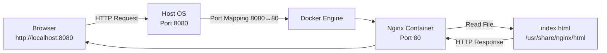
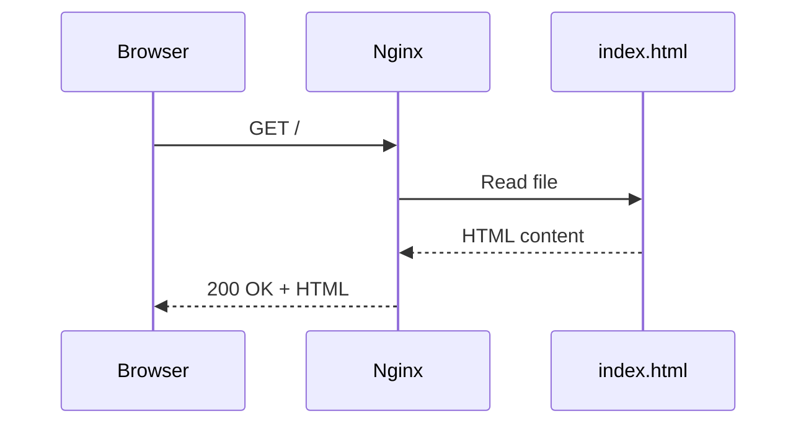
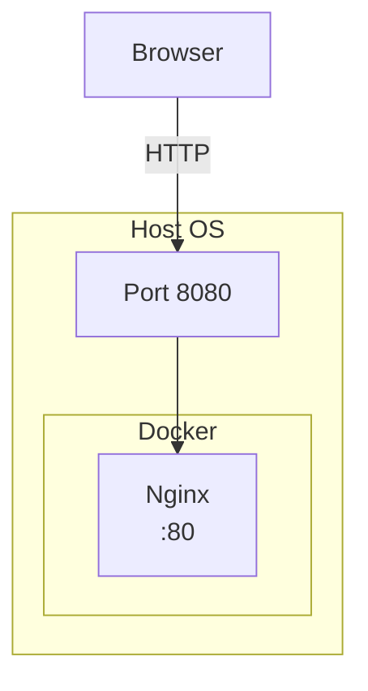

Docker Architecture Diagram

# ネットワーク視点の構成図

```mermaid
flowchart LR
    Browser[Browser<br/>http://localhost:8080]
    Host[Host OS<br/>Port 8080]
    Docker[Docker Engine]
    Nginx[Nginx Container<br/>Port 80]
    HTML[index.html<br/>/usr/share/nginx/html]

    Browser -->|HTTP Request| Host
    Host -->|Port Mapping 8080→80| Docker
    Docker --> Nginx
    Nginx -->|Read File| HTML
    HTML -->|HTTP Response| Nginx
    Nginx --> Browser

```

# より抽象化した「Webとは何か」

```mermaid
sequenceDiagram
    participant B as Browser
    participant N as Nginx
    participant F as index.html

    B->>N: GET /
    N->>F: Read file
    F-->>N: HTML content
    N-->>B: 200 OK + HTML

```

# Dockerを含めた構造レイヤー図

```mermaid
flowchart TB
    subgraph Host OS
        subgraph Docker
            Nginx[Nginx<br/>:80]
        end
        Port[Port 8080]
    end

    Browser -->|HTTP| Port
    Port --> Nginx

```
