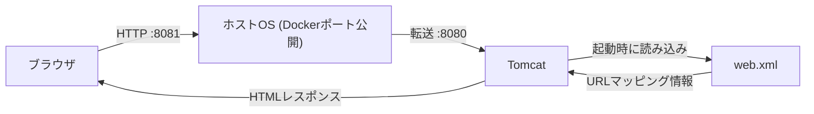

# DockerとTomcatで画面表示までを実装して理解する

## この記事で伝えたいこと
- Docker上のTomcatで、ブラウザ表示まで到達する実装フロー
- `Dockerfile`で何をどこへ配置すれば動くのか
- `web.xml` と Servlet の最小構成

## 想定読者
- Tomcatを初めて触る人
- Java Webアプリの表示までの流れを具体的に掴みたい人
- Dockerで再現できる学習手順が欲しい人

## 完成イメージ

Tomcat配下の`webapps/ROOT`に`WEB-INF/web.xml`・`WEB-INF/classes`・静的ファイルを正しく配置すれば、Docker経由でブラウザ表示まで到達できます。

## 使用技術
- Docker
- Tomcat
- Servlet

## 実装
1. ディレクトリ構成を作る

```text
your-project/
├── Dockerfile
├── docker-compose.yml
├── src/
│   └── main/
│       └── java/
│           └── com/example/HelloServlet.java
└── webapp/
    ├── index.html
    └── WEB-INF/
        └── web.xml
```

2. DockerfileでTomcatイメージを作る

```dockerfile
FROM tomcat:10.1-jdk17-temurin

WORKDIR /work

COPY src ./src
COPY webapp ./webapp

RUN mkdir -p /usr/local/tomcat/webapps/ROOT/WEB-INF/classes \
    && javac -cp /usr/local/tomcat/lib/servlet-api.jar \
       -d /usr/local/tomcat/webapps/ROOT/WEB-INF/classes \
       $(find ./src/main/java -name "*.java")
```

- `COPY src ./src`: Javaソースを`/work/src`へ配置
- `javac -d .../WEB-INF/classes`: コンパイル済み`.class`をTomcat配下へ配置
- `cp -r ./webapp/* .../webapps/ROOT/`: `web.xml`や静的ファイルをROOTアプリへ配置

3. Servletを実装する

```java
package com.example;

import java.io.IOException;
import java.io.PrintWriter;
import jakarta.servlet.http.HttpServlet;
import jakarta.servlet.http.HttpServletRequest;
import jakarta.servlet.http.HttpServletResponse;

public class HelloServlet extends HttpServlet {
    @Override
    protected void doGet(HttpServletRequest req, HttpServletResponse res) throws IOException {
        res.setContentType("text/plain; charset=UTF-8");
        PrintWriter out = res.getWriter();
        out.println("Hello from Servlet on Tomcat");
    }
}
```

4. `web.xml`でURLをマッピングする

```xml
<?xml version="1.0" encoding="UTF-8"?>
<web-app xmlns="https://jakarta.ee/xml/ns/jakartaee"
         xmlns:xsi="http://www.w3.org/2001/XMLSchema-instance"
         xsi:schemaLocation="https://jakarta.ee/xml/ns/jakartaee https://jakarta.ee/xml/ns/jakartaee/web-app_6_0.xsd"
         version="6.0">
  <servlet>
    <servlet-name>HelloServlet</servlet-name>
    <servlet-class>com.example.HelloServlet</servlet-class>
  </servlet>
  <servlet-mapping>
    <servlet-name>HelloServlet</servlet-name>
    <url-pattern>/hello</url-pattern>
  </servlet-mapping>
</web-app>
```
5.docker-compose.ymlを作る（8081:8080を公開）
```yml
version: "3.9"

services:
    tomcat:
        build:
            context: .
            dockerfile: Dockerfile
        ports:
            - "8081:8080"
```

6. 起動して表示を確認する

```bash
docker compose up -d --build
curl -v http://localhost:8081/hello
```

実行結果例:
```text
* Host localhost:8081 was resolved.
* IPv6: ::1
* IPv4: 127.0.0.1
*   Trying [::1]:8081...
* Connected to localhost (::1) port 8081
> GET /hello HTTP/1.1
> Host: localhost:8081
> User-Agent: curl/8.7.1
> Accept: */*
>
* Request completely sent off
< HTTP/1.1 200
< Content-Type: text/plain;charset=UTF-8
< Content-Length: 30
< Date: Sat, 21 Feb 2026 13:44:30 GMT
<
Hello from Servlet on Tomcat!
```

`HTTP/1.1 200`、`Content-Type`、本文 `Hello from Servlet on Tomcat!` が確認できれば、Servletの表示まで到達できています。

## まとめ
Docker + Tomcatで画面表示まで進めるコツは、次の3点です。
- `WEB-INF/classes`にコンパイル済みクラスを置く
- `WEB-INF/web.xml`でURLマッピングを定義する
- `webapps/ROOT`へ正しいファイルを配置する
