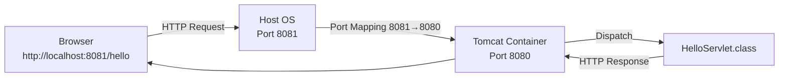

# 02-java-servlet-tomcat

## 概要
Java Webアプリの正体を知る。
Tomcat上で最小のServletを動かし、JavaアプリケーションがWeb上でどう振る舞うかを理解する。

## 関連ドキュメント
- Dockerfile設定手順: `SETUP_STEPS.md`
- ビルドエラーログ: `BUILD_ERRORS.md`
- `curl`エラー時の切り分け: `TROUBLESHOOTING.md`
- 補足知識（Servlet/Jakarta/Dockerコマンド）: `CONCEPTS.md`
- ターミナル履歴検索メモ: `TERMINAL_HISTORY_TIPS.md`

## 何を学べるのか
- TomcatがServletコンテナである意味
- Javaアプリは「ただのプロセス」であること
- HTTPとJavaコードの接点

## 使用技術
- Java
- Tomcat
- Servlet

## 補足メモ

### Dockerイメージとは
- イメージは「コンテナの設計図 + 実行に必要なファイル一式」
- コンテナはイメージから起動される実体（プロセス）
- `docker compose build` はイメージを作る操作
- `docker compose up` はイメージからコンテナを作成・起動する操作

### `curl -i` とは
- `-i` はレスポンスヘッダーも表示するオプション
- `HTTP/1.1 200` や `Content-Type` を同時に確認できる

例:
```bash
curl -i http://localhost:8081/hello
```

### `localhost`・`hosts`・ループバックの関係
- `localhost` はホスト名（名前）で、通常は `hosts` ファイルにより `127.0.0.1`（IPv4）や `::1`（IPv6）へ名前解決される
- `127.0.0.1` 宛の通信は、物理ネットワークには出ずOS内で完結する
- この内部経路を担当するのがループバックインターフェース（`lo`）
- つまり流れは `localhost`（名前） -> `127.0.0.1`（解決先IP） -> `lo`（通信経路）

## 構成図（Mermaid）


## 手順
以下はすべてターミナルで実行する。  
（前提）プロジェクトルート: `/Users/ktoyo/Documents/Web-under-the-hood`

### 1. ディレクトリ構成を作る

```bash
cd /Users/ktoyo/Documents/Web-under-the-hood/02-java-servlet-tomcat && mkdir -p src/main/java/com/example webapp/WEB-INF
```

### 2. `HelloServlet` を作る（`doGet` でレスポンス返却）

```bash
cat > /Users/ktoyo/Documents/Web-under-the-hood/02-java-servlet-tomcat/src/main/java/com/example/HelloServlet.java <<'EOF'
package com.example;

import java.io.IOException;
import java.io.PrintWriter;
import jakarta.servlet.http.HttpServlet;
import jakarta.servlet.http.HttpServletRequest;
import jakarta.servlet.http.HttpServletResponse;

public class HelloServlet extends HttpServlet {
    @Override
    protected void doGet(HttpServletRequest req, HttpServletResponse resp) throws IOException {
        resp.setContentType("text/plain; charset=UTF-8");
        PrintWriter out = resp.getWriter();
        out.println("Hello from Servlet on Tomcat!");
    }
}
EOF
```

### 3. `web.xml` で `/hello` にマッピング

```bash
cat > /Users/ktoyo/Documents/Web-under-the-hood/02-java-servlet-tomcat/webapp/WEB-INF/web.xml <<'EOF'
<?xml version="1.0" encoding="UTF-8"?>
<web-app xmlns="https://jakarta.ee/xml/ns/jakartaee"
         xmlns:xsi="http://www.w3.org/2001/XMLSchema-instance"
         xsi:schemaLocation="https://jakarta.ee/xml/ns/jakartaee https://jakarta.ee/xml/ns/jakartaee/web-app_6_0.xsd"
         version="6.0">
  <servlet>
    <servlet-name>HelloServlet</servlet-name>
    <servlet-class>com.example.HelloServlet</servlet-class>
  </servlet>
  <servlet-mapping>
    <servlet-name>HelloServlet</servlet-name>
    <url-pattern>/hello</url-pattern>
  </servlet-mapping>
</web-app>
EOF
```

### 4. `Dockerfile` を作る（Tomcat + `javac` でServletを配置）

```bash
cat > /Users/ktoyo/Documents/Web-under-the-hood/02-java-servlet-tomcat/Dockerfile <<'EOF'
FROM tomcat:10.1-jdk17-temurin

WORKDIR /work
COPY src ./src
COPY webapp ./webapp

RUN mkdir -p /usr/local/tomcat/webapps/ROOT/WEB-INF/classes \
    && javac -cp /usr/local/tomcat/lib/servlet-api.jar \
       -d /usr/local/tomcat/webapps/ROOT/WEB-INF/classes \
       $(find ./src/main/java -name "*.java")

RUN cp -r ./webapp/* /usr/local/tomcat/webapps/ROOT/ 2>/dev/null || true
EOF
```

### 5. `docker-compose.yml` を作る（`8081:8080` を公開）

```bash
cat > /Users/ktoyo/Documents/Web-under-the-hood/02-java-servlet-tomcat/docker-compose.yml <<'EOF'
version: "3.9"
services:
  tomcat:
    build:
      context: .
      dockerfile: Dockerfile
    ports:
     - "8081:8080"
EOF
```

### 6. 起動して確認する

```bash
cd /Users/ktoyo/Documents/Web-under-the-hood/02-java-servlet-tomcat && docker compose up --build -d && curl -i http://localhost:8081/hello
```

`docker compose up --build -d` の意味:
- `docker compose up`: `docker-compose.yml` の定義に従ってコンテナを作成・起動する
- `--build`: 起動前にイメージをビルドする（`Dockerfile` の変更を反映する）
- `-d`: デタッチドモード（バックグラウンド実行）で起動する

つまりこのコマンドは、  
「最新の設定でイメージを作り直して、コンテナを裏で立ち上げる」という動作になる。

### 構文エラーを検出する方法

`Dockerfile` のビルド時に `javac` で `src/main/java` 配下をコンパイルするため、  
Javaの構文が間違っていると `docker compose build` が失敗してエラーが表示される。

```bash
cd /Users/ktoyo/Documents/Web-under-the-hood/02-java-servlet-tomcat && docker compose build --no-cache
```

停止:

```bash
cd /Users/ktoyo/Documents/Web-under-the-hood/02-java-servlet-tomcat && docker compose down
```

## なぜこの構成なのか
01ではNginxが「ファイルを返すWebサーバー」であることを学んだ。
02ではTomcatを使い、同じHTTPリクエストに対して「Javaコードを実行してレスポンスを生成する」世界に進む。

## リクエストの流れ
1. ブラウザが `http://localhost:8081/hello` に `GET` を送る
2. Dockerのポートマッピングで、ホスト `8081` の通信がコンテナ内Tomcat `8080` に届く
3. Tomcatは起動時に `web.xml` を読み、`/hello -> com.example.HelloServlet` の対応を登録済み
4. リクエスト到着時、TomcatがURL `/hello` を見て、そのマッピングに一致するServletを特定する
5. Tomcatが `HelloServlet` をロード（初回）し、必要ならインスタンス化・初期化して管理下に置く
6. `GET` なので Tomcatが `doGet(req, res)` を呼ぶ
7. `HelloServlet#doGet` が `Content-Type` を設定し、`PrintWriter` で本文を書き込む
8. Tomcatがその内容をHTTPレスポンス（ステータス・ヘッダー・ボディ）として返す
9. ブラウザ（または `curl -i`）がレスポンスを受け取り表示する

## 触るポイント


## よくある失敗
- ビルドエラー実例は `BUILD_ERRORS.md` を参照
- `curl` 実行時の切り分けは `TROUBLESHOOTING.md` を参照

## 実務との対応

## Docker運用コマンド

動いているコンテナ確認:
```bash
docker ps
docker compose ps
```

コンテナ削除:
```bash
docker rm <CONTAINER_ID_OR_NAME>
docker rm -f <CONTAINER_ID_OR_NAME>
docker compose down
```

イメージ確認:
```bash
docker images
docker stats --no-stream
```

特定イメージを一括削除:
```bash
docker rmi 7798de2abd51 5860fce48dc2 b1e17acf9e09 9fcb2ad1e8e1 3a0d63427831
```

未使用イメージの掃除:
```bash
docker image prune
```


## 次にやるなら
