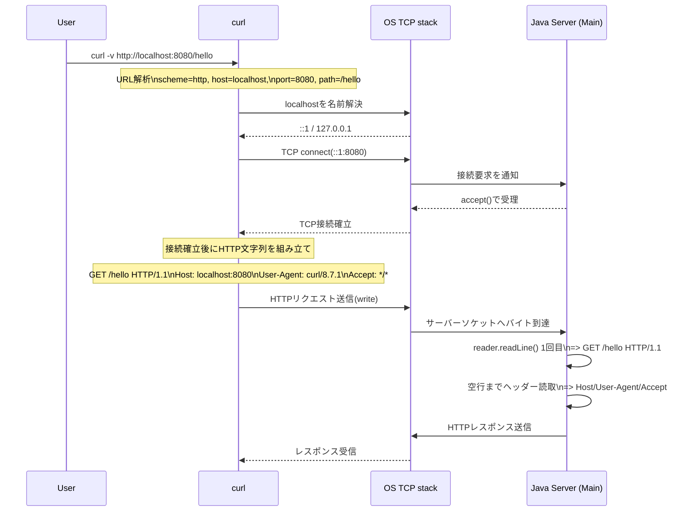
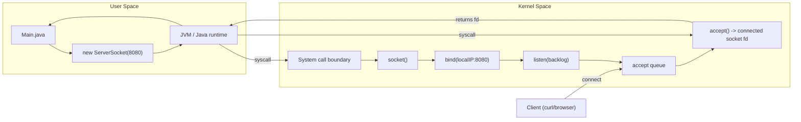

# JVM / OS 観測Q&A（03-java-only-http-server）

このファイルは、`SETUP_STEPS.md` で出た「周辺知識」の質問をまとめた補助ノートです。  
実装手順とは分けて、仕組み理解と調査観点に集中します。

## 1. `Main.java` は本当にサーバーになっている？

はい。`new ServerSocket(8080)` を実行すると、OS上で `8080` が `LISTEN` 状態になります。  
`while (true) { server.accept(); }` で接続待ちを繰り返すため、Javaプロセス自体がサーバーとして動作します。

確認コマンド:
```bash
lsof -nP -iTCP:8080 -sTCP:LISTEN
```

## 2. ループバックとは？

ループバックは「自分のPCに戻る仮想ネットワーク経路」です。

- IPv4: `127.0.0.1`
- IPv6: `::1`
- `localhost` は通常このどちらかに解決される

`curl http://localhost:8080` は外部ネットワークに出ず、同一マシン内で通信します。

## 3. なぜ `curl` から `Main.java` に通信できる？

流れ:
1. Javaが `ServerSocket(8080)` で待ち受ける
2. `curl` が `localhost:8080` に `connect()` する
3. OSのTCPスタックが同一マシン内の待ち受けソケットに接続を渡す
4. Javaの `accept()` が接続を受け取る

Step 2ではレスポンスを書かないため、`curl` 側は `Empty reply from server` になります。

## 3-1. 何が起きているか（ポート占有 -> `curl` 呼び出し）

1. `java -cp src Main` を実行すると、JVMが `Main` クラスを読み込む。
2. `new ServerSocket(8080)` でJavaがOSに「ソケット作成」「`bind(8080)`」「`listen`」を依頼する。
3. OSはそのプロセスに `8080` を割り当て、`LISTEN` 状態にする（ポート占有）。
4. Javaは `accept()` で接続待ちし、接続が来るまでブロックする。
5. `curl -v http://localhost:8080` を実行すると、`localhost` が `::1`（または `127.0.0.1`）に解決される。
6. `curl` 側OSはクライアント用の一時ポート（例: `52201`）を選び、`::1:8080` へ `connect()` する。
7. TCP 3ウェイハンドシェイク（`SYN -> SYN/ACK -> ACK`）が行われ、接続は `ESTABLISHED` になる。
8. サーバー側OSは接続済みソケットを `accept` キューに入れる。
9. `accept()` が解除され、Javaに `Socket client` が返る。
10. `client.getRemoteSocketAddress()` は相手情報を返し、`[::1]:52201` のように表示される。
11. `curl` はHTTPリクエスト行とヘッダー（例: `GET / HTTP/1.1`）を送信する。
12. Step 2 のコードはレスポンスを書かないため、`curl` は `Empty reply from server` になる。
13. `try (Socket client = ...)` を抜けると、その接続用ソケットだけ閉じる。
14. `while (true)` によりサーバーは再び `accept()` に戻り、`8080` の `LISTEN` は継続する。
15. Javaプロセス終了（`Ctrl + C`）または `ServerSocket.close()` で `8080` の占有が解放される。

## 3-2. ソケット通信の基本

- ソケットは「通信の端点」。
- サーバー側には役割が2つある:
1. `ServerSocket`: 待ち受け専用（`LISTEN`）
2. `Socket`（`accept()` が返す）: その接続専用の送受信用
- TCPは「バイト列の連続」を運ぶだけで、メッセージ境界は保証しない。
- そのためHTTP側で「開始行・ヘッダー・空行・本文」のルールをアプリが守る必要がある。
- 再送・順序保証・輻輳制御はTCP（OSカーネル）の担当。
- Javaコードの主な責務は「いつ `accept/read/write/close` するか」を決めること。

## 4. 名前解決は誰がやる？（OS or JVM）

通常はOSの名前解決機構が担当します。  
Javaやcurlは基本的にOSのresolverを利用します。

- `localhost` は多くの環境で `/etc/hosts` から解決される
- JVMは解決結果をキャッシュする（`InetAddress` キャッシュ）

確認コマンド:
```bash
rg -n 'localhost' /etc/hosts
dscacheutil -q host -a name localhost
```

## 5. `cp` と `java -cp` は別物？

- `cp`（シェルコマンド）: ファイルコピー
- `java -cp` の `-cp`: `classpath` の指定（クラス探索パス）

`java -cp src Main` は「`src` から `Main.class` を探して実行する」だけで、コピーはしません。

## 6. `Accept: /[::1]:52201` の数字は何？

- `::1` はlocalhost（IPv6）
- `52201` はクライアント側の一時ポート（ephemeral port）

サーバー側固定ポート `8080` とは別です。接続ごとに変わるのが正常です。

## 7. `curl -v` の意味

`-v` は `--verbose` で、以下を表示します。

- 名前解決結果
- 接続先と接続成否
- 送信リクエスト行/ヘッダー
- 受信レスポンス行/ヘッダー
- 接続終了理由

HTTP学習では、実際の通信内容を確認するために有効です。

## 8. スレッドダンプ（`jstack`）の読み方（初心者向け）

最重要ポイントは `main` スレッドのスタックです。

例:
```text
at java.net.ServerSocket.accept(...)
at Main.main(Main.java:13)
```

意味:
- `Main.java:13` で `accept()` 待ち
- サーバーは停止していない
- 「接続待ち中」の正常状態

補足:
- `Reference Handler` や `Finalizer`、`CompilerThread` はJVMの内部スレッドで通常存在する
- `RUNNABLE` 表示でも、ネイティブI/O待機を含むことがある

## 9. 実務でどこに効く？

障害切り分けで有効です。

1. API遅延/タイムアウト: どこ待ちか（DB/外部API/ロック）を特定
2. CPU高騰: 無限ループやホットパスを特定
3. 503/処理詰まり: accept済みか、アプリ処理で詰まるかを分離
4. デッドロック: ロック競合箇所を特定
5. 停止しない問題: 生き残っているスレッドを特定

## 10. よく使う観測コマンド

```bash
# Javaプロセス
jps -l

# スレッドダンプ
jstack <pid>

# JVM情報
jcmd <pid> VM.version
jcmd <pid> VM.system_properties | rg 'java.net|os\\.|java\\.home'

# 8080待ち受け状態
lsof -nP -iTCP:8080 -sTCP:LISTEN
lsof -nP -iTCP:8080
```

## 11. `jstack` のよく使う使い方（最小）

1. PID確認:
```bash
jps -l
```

2. まず取得（基本）:
```bash
jstack <pid>
```

3. ロック情報つき（競合調査）:
```bash
jstack -l <pid>
```

4. 詳細つき（必要なときだけ）:
```bash
jstack -e <pid>
jstack -l -e <pid>
```

5. 調査ログとして保存:
```bash
jstack -l <pid> > jstack_$(date +%Y%m%d_%H%M%S).txt
```

## 12. 追加Q&A（通信の挙動）

### Q1. `Connection reset by peer`（RST）とは？

- `RST` は TCP の `Reset`（強制切断）フラグ。
- 意味は「この接続を今すぐ無効化する」。
- `FIN` の通常終了より強い切断で、異常/拒否寄りの終了として扱われる。

よくある発生ケース:
- 相手プロセスが想定外状態で接続を即切断した
- そのポートで待受していないのにパケットが来た
- アプリが未読データを残したままソケットを閉じた

`Connection reset by peer` は「相手側からRSTを受けた」という意味。

### Q2. `java -cp src Main` と `curl` は同じ実行ファイル？

- 同じではない。
- `java -cp src Main`: `Main.class` でサーバープロセスを起動
- `curl -v http://localhost:8080`: `curl` という別のクライアントプロセスを起動

同じPC上で「サーバー（Main）」と「クライアント（curl）」の2プロセスがTCP通信している。

### Q3. `\r\n` の `\r` は何？

- `\r` は carriage return（復帰）
- `\n` は line feed（改行）
- HTTPヘッダーは仕様上、行末を `\r\n` で区切る
- `\r\n\r\n`（空行）でヘッダー終了を表す

### Q4. `OutputStream out = client.getOutputStream();` はどこに通じる？

- `client = server.accept()` で、`curl` との1接続を表す `Socket` を得る
- `client.getOutputStream()` はその接続の「サーバー -> クライアント」送信口
- `out.write(headerBytes)` がレスポンスヘッダーとして `curl -v` に表示される
- `out.write(bodyBytes)` がレスポンス本文として `curl` に表示される
- `out.flush()` でOSへ送信を確定する

対応関係:
- Java `out.write(headerBytes)` -> `curl -v` の `< HTTP/1.1 ...` と `< Content-* ...`
- Java `out.write(bodyBytes)` -> `curl` の本文表示

## 13. 追加Q&A（Step 4/5の読み取りとcurlの送信内容）

### Q1. `BufferedReader reader` と `requestLine` は何をしている？

- `BufferedReader reader` は `client.getInputStream()` の生バイトを「行単位の文字列」で読むためのラッパー。
- `String requestLine = reader.readLine();` はHTTPリクエストの1行目を取得する。
- 例: `GET /hello HTTP/1.1`
- その後、`requestLine.split(" ")` で `method` と `path` を取り出し、ルーティングに使う。

今回の読み取りイメージ:
```http
GET /hello HTTP/1.1
Host: localhost:8080
User-Agent: curl/8.7.1
Accept: */*

```

- 1回目の `readLine()` で `GET /hello HTTP/1.1` を取得
- その後の `while (readLine...)` で `Host` などのヘッダーを空行まで読み進める

### Q2. なぜ `curl` 実行だけで `GET /hello HTTP/1.1` や `Host: localhost:8080` が送られる？

- `curl -v http://localhost:8080/hello` のURLを `curl` が解析して、HTTPリクエスト文字列を自動生成するため。
- `GET /hello HTTP/1.1` はURLの `path=/hello` から組み立てられるリクエスト行。
- `Host: localhost:8080` はHTTP/1.1で必要なヘッダーなので `curl` が自動付与する。

### Q3. 付与されるタイミング（シーケンス）



## 14. 追加Q&A（ポートの見方）

### Q1. サーバーが `8080` を開いていれば十分？クライアント側の一時ポートも必要？

はい、両方必要。

- サーバー側: 待受ポート（例: `8080`）
- クライアント側: 一時ポート（例: `63183`）

TCP接続は次の4つ組で識別される:
- `clientIP`
- `clientPort`
- `serverIP`
- `serverPort`

一時ポートはレスポンス専用ではなく、接続開始時（`connect()`）から使われ、同じ接続の送受信両方で使われる。

### Q2. `Accepted: /[0:0:0:0:0:0:0:1]:63183` は何を示す？

- `[0:0:0:0:0:0:0:1]` は `::1`（IPv6 localhost）
- `:63183` はクライアント側の一時ポート

これは `client.getRemoteSocketAddress()` の値なので、表示しているのは「相手（クライアント）側」の情報。

接続全体の例:
- `::1:63183 -> ::1:8080`

このとき:
- 左側がクライアント（curl）
- 右側がサーバー（Main）

## 15. 追加Q&A（ServerSocketの低レイヤーとブラウザ表示）

### Q1. `new ServerSocket(8080)` は何をしている？

- Javaオブジェクトを作るだけでなく、OSに対して待受ソケット作成を依頼している。
- 低レイヤーでは概ね `socket()` -> `bind()` -> `listen()` の順で実行される。
- 結果としてOS上で `8080` が `LISTEN` 状態になる。

### Q2. TCPソケットはどこに作られる？

- ソケット実体はOSのカーネル空間（ネットワークスタック管理領域）に作られる。
- Javaプロセスは、そのソケットを参照するファイルディスクリプタを持って操作する。

構成図（JVMからOSへ依頼される流れ）:



### Q3. `bind`（指定ポートにバインド）とは？

- 「このソケットにローカルIP:ポートを割り当てる」操作。
- 例: `::1:8080` または `0.0.0.0:8080`。
- これによりOSは「8080宛の接続をこの待受ソケットに渡す」と判断できるようになる。

### Q4. OS上の空間は他に何がある？

大きく2つ:

1. ユーザー空間
- `java`, `curl`, ブラウザなどのアプリが動く場所
- ハードウェアやネットワーク制御は直接できず、システムコールでOSに依頼する

2. カーネル空間
- OS本体が動く場所
- プロセス管理、メモリ管理、ファイルシステム、ネットワークスタック、ドライバなどを担当する

### Q5. なぜブラウザは文字を表示できる？

- HTTPレスポンスのヘッダーを見て、本文をどう解釈するか決めるため。
- 具体的には `Content-Type` と `charset` を見て本文バイト列を文字に変換する。

例:
- `text/plain` -> 文字として表示
- `text/html` -> HTMLとして解析して描画
- `application/json` -> JSONデータとして扱う（表示/整形）

ポイント:
- 本文だけでなく `Content-Type` と `Content-Length` の整合が表示品質に直結する。

## 16. 追加Q&A（fdとOS内部の流れ）

### Q1. `fd` とは何？

- `fd` は `file descriptor`（ファイルディスクリプタ）の略。
- OSがプロセスに渡す「開いている対象（ファイル/ソケットなど）への番号付きハンドル」。
- `socket()` の戻り値も `fd` で、この番号を使って `bind/listen/accept/read/write/close` を行う。

### Q2. OS上で「connectできるポート」を作る流れ（fd視点）

1. JVMが `socket()` を呼ぶ。
2. カーネルがソケットオブジェクトを作る。
3. カーネルがそのソケットをプロセスのFDテーブルに登録し、`fd` を返す。
4. JVMが `bind(fd, localIP:port)` を呼ぶ（例: `:8080`）。
5. カーネルが「このポート宛はこのソケットへ」の対応を作る。
6. JVMが `listen(fd, backlog)` を呼ぶ。
7. カーネルがソケットを `LISTEN` 状態にして接続待ちキューを有効化する。
8. クライアントが `connect(serverIP:port)` を実行する。
9. カーネルがTCP 3-way handshakeを完了し、接続をacceptキューに入れる。
10. JVMが `accept(fd)` を呼ぶ。
11. カーネルが接続済みソケット用の新しい `fd` を返す。
12. JVMはその接続用 `fd` で `read/write` し、終了時に `close(fd)` で解放する。

### Q3. 「`ServerSocket`は待受専用、`Socket`は接続ごとの送受信用」とは？

- `ServerSocket`
  - 役割: 待受専用の受付窓口
  - 使う操作: `accept()` で接続を受ける
  - データ本体の読み書きはしない

- `Socket`（`accept()` が返す）
  - 役割: 1接続専用の通信路
  - 使う操作: `getInputStream()` / `getOutputStream()` で送受信する

イメージ:
- `ServerSocket` = 店の受付
- `Socket` = 受付後に案内される個室（1組ごと）

### Q4. TCP 3-way handshake は acceptキューの時に発生する？

- 正確には「acceptキューの前段」で発生する。
- 流れ:
1. クライアントが `SYN` を送る
2. サーバーが `SYN/ACK` を返す
3. クライアントが `ACK` を返す
4. 接続確立後、カーネルが接続をacceptキューに入れる
5. `accept()` がその接続を取り出す

### Q5. `RST` とは何？

- `RST` はTCPの `Reset` フラグ。
- 意味は「接続を即時に強制終了する」。
- `FIN` は通常の終了、`RST` は異常/拒否時の即時終了。
- `Connection reset by peer` は「相手側から `RST` を受けて切断された」という意味。

## 17. 追加Q&A（わかりづらかった点の言い換え）

### Q1. `Accepted: /[::1]:63183` はどう読む？

- この表示は `client.getRemoteSocketAddress()` の値。
- `remote` は「相手側（クライアント側）」の意味。
- `::1` は相手のIP（localhostのIPv6）
- `63183` は相手の一時ポート（ephemeral port）

接続全体で書くと:
- `::1:63183 -> ::1:8080`
- 左がクライアント、右がサーバー

### Q2. なぜサーバーポートとクライアント一時ポートの両方が必要？

わかりやすい説明:
- サーバーポート（8080）は「店の住所」
- クライアント一時ポート（63183）は「お客さんの整理番号」

サーバーは受付（8080）だけで受信できるが、返信時には「どのお客さんに返すか」を区別する必要がある。  
そのためクライアント側にも一時ポートが必要になる。

実務での正確な言い方:
- 接続は `clientIP/clientPort/serverIP/serverPort`（4タプル）で識別される。

## 用語メモ

- 輻輳制御: `ふくそうせいぎょ`
