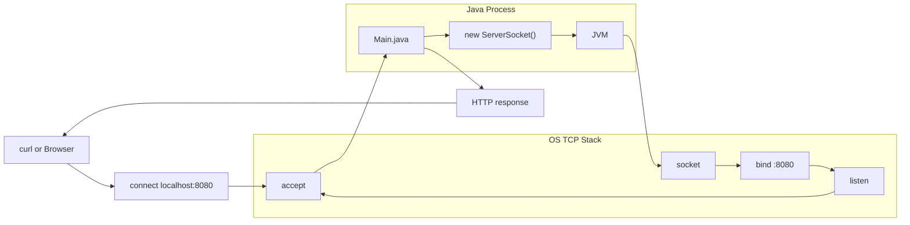

# フレームワークなしJavaサーバーで学ぶHTTPとTCPの基礎

## この記事で伝えたいこと
- フレームワークなしでも、JavaだけでHTTPサーバーを立ててTCP通信できること
- JavaがHTTPリクエスト行を読み取り、`method/path`（例: `GET /hello`, `GET /api/hello`）をもとに応答を切り替える流れ
- `localhost` と `8080` が示す意味（接続先ホストと待受ポート）

## 想定読者
- `localhost:8080` の通信の裏側で、何が起きているのか知りたい人
- Javaで `Hello World` サーバーを動かしてみたい人
- 簡易的にホストとサーバーを実行して仕組みを確認したい人

## 完成イメージ



補足:
- 実行順序は `JVM起動 -> Main.class読込 -> main()実行 -> new ServerSocket() -> socket/bind/listen`。
- `Main.java` がJVMを起動するのではなく、JVMが `Main` を実行する。
- 図の `JVM -> socket` は、JVMがOSに `socket -> bind -> listen` を依頼して待受状態を作ることを表している。

## 使用技術
- Java 17
- `java.net.ServerSocket` / `java.net.Socket`
- curl

## 実装
### 1. 最小サーバーを起動する

まずは `ServerSocket(8080)` で待ち受けるだけの最小構成を作る。  
この段階ではHTTPレスポンスはまだ返さず、「接続を受け取れるか」を確認する。

```java
import java.io.IOException;
import java.net.ServerSocket;
import java.net.Socket;

public class Main {
    public static void main(String[] args) {
        int port = 8080;

        try (ServerSocket server = new ServerSocket(port)) {
            System.out.println("Server listening on port " + port);

            while (true) {
                try (Socket client = server.accept()) {
                    System.out.println("Accepted: " + client.getRemoteSocketAddress());
                } catch (IOException e) {
                    System.err.println("Failed to handle client: " + e.getMessage());
                }
            }
        } catch (IOException e) {
            System.err.println("Failed to start server: " + e.getMessage());
        }
    }
}
```

ここで最初に疑問に感じやすかったのが「なぜ `try` の中で `ServerSocket` を作って `accept()` まで呼ぶのか」という点。  
`ServerSocket` は待受用、`accept()` が返す `Socket` は接続ごとの通信用、という役割分担になる。

確認コマンド:

```bash
javac src/Main.java
java -cp src Main
```

別ターミナル:

```bash
curl -v http://localhost:8080/
```

期待結果:
- サーバーログに `Accepted: ...` が出る
- `curl` 側はこの段階では `Empty reply from server` でも正常（まだレスポンス未実装のため）

この最小実装で分かったのは、サーバーの最小単位は「リクエストを受けてレスポンスを返す」という往復だということ。  
最初は「サーバーはもっと大きく複雑なもの」と捉えていたが、土台は結構シンプル。


### 2. 固定レスポンスを返す

次はHTTPレスポンスを固定で返す。  
この段階の目的は「HTTPは文字列ルールで成り立つ」ことを体感すること。

```java
import java.io.IOException;
import java.io.OutputStream;
import java.net.ServerSocket;
import java.net.Socket;
import java.nio.charset.StandardCharsets;

public class Main {
    public static void main(String[] args) {
        int port = 8080;
        String body = "Hello World";
        byte[] bodyBytes = body.getBytes(StandardCharsets.UTF_8);

        String headers =
                "HTTP/1.1 200 OK\r\n" +
                "Content-Type: text/plain; charset=UTF-8\r\n" +
                "Content-Length: " + bodyBytes.length + "\r\n" +
                "Connection: close\r\n" +
                "\r\n";

        try (ServerSocket server = new ServerSocket(port)) {
            System.out.println("Server listening on port " + port);

            while (true) {
                try (Socket client = server.accept()) {
                    System.out.println("Accepted: " + client.getRemoteSocketAddress());

                    OutputStream out = client.getOutputStream();
                    out.write(headers.getBytes(StandardCharsets.UTF_8));
                    out.write(bodyBytes);
                    out.flush();
                } catch (IOException e) {
                    System.err.println("Failed to handle client: " + e.getMessage());
                }
            }
        } catch (IOException e) {
            System.err.println("Failed to start server: " + e.getMessage());
        }
    }
}
```

確認コマンド:

```bash
javac src/Main.java
java -cp src Main
```

別ターミナル:

```bash
curl -v http://localhost:8080/
```

期待結果（例: ダミー値）:

```text
Server listening on port 8080
Accepted: /[0:0:0:0:0:0:0:1]:52341
```
補足: `Accepted: /[0:0:0:0:0:0:0:1]:52341` の読み方
- `[0:0:0:0:0:0:0:1]` は `::1`（IPv6 localhost）
- `:52341` はクライアント側の一時ポート
- これは `client.getRemoteSocketAddress()` の表示なので、相手（クライアント）側の情報が出ている

```text
$ curl -v http://localhost:8080/
* Connected to localhost (::1) port 8080
> GET / HTTP/1.1
> Host: localhost:8080
> User-Agent: curl/8.7.1
> Accept: */*
< HTTP/1.1 200 OK
< Content-Type: text/plain; charset=UTF-8
< Content-Length: 11
< Connection: close
Hello World
```

ここで、ステータス行・ヘッダー・本文を自分で組み立てることで、  
フレームワークなしでもHTTPレスポンスは返せることが分かります。

#### 疑問: なぜ `curl` から `Main.java` に通信できるのか

最初は「同じPC上で、なぜ `curl` が `Main.java` に届くのか」がよくわかりませんでした。 
どうやら以下のフローで、通信が行われているようです。

1. `Main.java` が `ServerSocket(8080)` で待受を開始する  
2. `curl` が `localhost:8080` に `connect` する  
3. OSのTCPスタックが、その接続を待受ソケットへ渡す  
4. Java側の `accept()` が接続を受け取る  

つまり、`curl` と `Main.java` は同じマシン上の別プロセスとして、OSのTCPスタックを介して通信している。
ちなみに、TCP通信を確立するのに3ウェイハンドシェイクという技術を使っているらしい。

### 3. リクエスト行とヘッダーを読む

次に、クライアントから来たHTTPリクエストを読み取る。  
ここでの目的は「`GET /hello HTTP/1.1` のような1行目を取り出し、`method/path` に分解できること」です。

```java
import java.io.BufferedReader;
import java.io.IOException;
import java.io.InputStreamReader;
import java.io.OutputStream;
import java.net.ServerSocket;
import java.net.Socket;
import java.nio.charset.StandardCharsets;

public class Main {
    public static void main(String[] args) {
        int port = 8080;
        String body = "Hello World";
        byte[] bodyBytes = body.getBytes(StandardCharsets.UTF_8);

        String headers =
                "HTTP/1.1 200 OK\r\n" +
                "Content-Type: text/plain; charset=UTF-8\r\n" +
                "Content-Length: " + bodyBytes.length + "\r\n" +
                "Connection: close\r\n" +
                "\r\n";

        try (ServerSocket server = new ServerSocket(port)) {
            System.out.println("Server listening on port " + port);

            while (true) {
                try (Socket client = server.accept()) {
                    BufferedReader reader = new BufferedReader(
                            new InputStreamReader(client.getInputStream(), StandardCharsets.UTF_8));

                    String requestLine = reader.readLine(); // 例: GET /hello HTTP/1.1
                    if (requestLine == null || requestLine.isEmpty()) {
                        continue;
                    }

                    String line;
                    while ((line = reader.readLine()) != null && !line.isEmpty()) {
                        // ヘッダーはこの段階では読み飛ばす
                    }

                    String[] parts = requestLine.split(" ");
                    String method = parts.length > 0 ? parts[0] : "";
                    String path = parts.length > 1 ? parts[1] : "";
                    System.out.println("method=" + method + ", path=" + path);

                    OutputStream out = client.getOutputStream();
                    out.write(headers.getBytes(StandardCharsets.UTF_8));
                    out.write(bodyBytes);
                    out.flush();
                } catch (IOException e) {
                    System.err.println("Failed to handle client: " + e.getMessage());
                }
            }
        } catch (IOException e) {
            System.err.println("Failed to start server: " + e.getMessage());
        }
    }
}
```

確認コマンド:

```bash
javac src/Main.java
java -cp src Main
```

別ターミナル:

```bash
curl -v http://localhost:8080/
curl -v http://localhost:8080/hello
curl -v http://localhost:8080/api/hello
```

期待結果（例: ダミー値）:

```text
Server listening on port 8080
method=GET, path=/
method=GET, path=/hello
method=GET, path=/api/hello
```

### 4. ルーティングを実装する（最後の仕上げ）

最後に、`method/path` で返却内容を切り替えていきます。  
`/`, `/hello`, `/api/hello` は `200`、それ以外は `404` を返します。

```java
if ("GET".equals(method) && "/".equals(path)) {
    status = "200 OK";
    contentType = "text/html; charset=UTF-8";
    responseBody = "<h1>Welcome</h1><p>Top page</p>";
} else if ("GET".equals(method) && "/hello".equals(path)) {
    status = "200 OK";
    contentType = "text/plain; charset=UTF-8";
    responseBody = "Hello World";
} else if ("GET".equals(method) && "/api/hello".equals(path)) {
    status = "200 OK";
    contentType = "application/json; charset=UTF-8";
    responseBody = "{\"message\":\"Hello API\"}";
} else {
    status = "404 Not Found";
    contentType = "text/plain; charset=UTF-8";
    responseBody = "Not Found";
}

byte[] bodyBytes = responseBody.getBytes(StandardCharsets.UTF_8);
String headers =
        "HTTP/1.1 " + status + "\r\n" +
        "Content-Type: " + contentType + "\r\n" +
        "Content-Length: " + bodyBytes.length + "\r\n" +
        "Connection: close\r\n" +
        "\r\n";
```

確認コマンド:

```bash
javac src/Main.java
java -cp src Main
```

別ターミナル:

```bash
curl -v http://localhost:8080/
curl -v http://localhost:8080/hello
curl -v http://localhost:8080/api/hello
curl -v http://localhost:8080/notfound
```

期待結果（例: ダミー値）:

```text
GET /           -> 200 OK, Content-Type: text/html, body: Welcome...
GET /hello      -> 200 OK, Content-Type: text/plain, body: Hello World
GET /api/hello  -> 200 OK, Content-Type: application/json, body: {"message":"Hello API"}
GET /notfound   -> 404 Not Found, Content-Type: text/plain, body: Not Found
```

### なぜブラウザは文字を表示できるのか
- ブラウザはHTTPレスポンスのヘッダーを見て、本文をどう解釈するか決める。
- 具体的には `Content-Type` と `charset` を見て、本文バイト列を文字に変換する。

例:
- `text/plain` -> 文字として表示
- `text/html` -> HTMLとして解析して描画
- `application/json` -> JSONデータとして扱う（表示/整形）

ポイント:
- 本文だけでなく `Content-Type` と `Content-Length` の整合が表示品質に直結する。


## まとめ

今回やってみて、`Hello World` の表示だけなら簡単そうに見えて、実際はかなり学びがありました。  
特に大きかったのは、次の3点です。

- JavaでもフレームワークなしでHTTPサーバーを立てられること
- `localhost:8080` の裏側で、`socket -> bind -> listen -> accept` が動いていること
- レスポンスは「本文だけ」ではなく、`status` / `Content-Type` / `Content-Length` をそろえて初めて成立すること

また、`curl` と `Main.java` が同じPC上の別プロセスとして、OSのTCPスタックを介して通信していることも理解できました。  
サーバーは難しい箱だと思っていたけど、土台は「受ける -> 読む -> 分岐する -> 返す」の繰り返しだと分かると整理しやすくなります。
