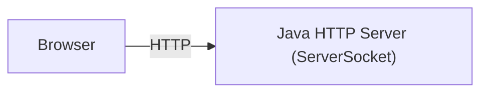

# 03-java-only-http-server

## 概要
01（静的配信）と02（Tomcat/Servlet）の次として、  
ライブラリなし・Javaのみで最小HTTPサーバーを作り、HTTPの正体を掴む。

## 何を学べるのか
- TCP待ち受けと接続受付の基本
- HTTPが文字列プロトコルであること
- リクエスト行/ヘッダーの構造
- ルーターを手で書く大変さ

## 使用技術
- Java（`ServerSocket`）
- curl

## 前提
- `01-static-web-nginx` で静的HTML配信は学習済み
- `02-java-servlet-tomcat` でServlet/Tomcatは学習済み

## 学習ステップ（03）

### 3-1. TCP待ち受けを作る
やること:
- `ServerSocket`で`8080`を待ち受ける
- 接続を`accept()`してログ出力する

目的:
- 「ポートにリッスンする」「接続を受ける」を体感する

### 3-2. 固定レスポンスを返す
やること:
- 受信内容を見ずに`200 OK`固定で`Hello World`を返す
- `Content-Type`と`Content-Length`を付ける

目的:
- HTTPがフレームワーク専用の魔法ではなく、ソケット上の文字列ルールだと理解する

### 3-3. リクエスト行とヘッダーを読む
やること:
- リクエスト1行目（例: `GET / HTTP/1.1`）を読み取る
- 空行までヘッダーを読み飛ばす

目的:
- HTTPリクエストの構造を理解する

### 3-4. ルーティングをifで実装する
やること:
- `GET /`だけ`200`にし、それ以外は`404`にする
- 次に`/hello`（text）、`/api/hello`（JSON）へ分岐を増やす
- 最後に`/`で簡単なHTMLも返す

目的:
- ルーティングを手で書くと分岐が増えることを体感する
- `Content-Type`でレスポンスの意味が変わることを理解する

### 3-5. 検証して説明できる状態にする
やること:
- `curl -v`でエンドポイントごとのステータス/ヘッダー/本文を確認する
- 正常系と404の両方を必ず確認する
- 処理の流れを口頭で説明できるように整理する

動作確認:
```bash
curl -v http://localhost:8080/
curl -v http://localhost:8080/hello
curl -v http://localhost:8080/api/hello
curl -v http://localhost:8080/notfound
```

## 構成図（Mermaid）


## なぜこの構成なのか
02で学んだServletの前に戻り、HTTP処理を最小単位から理解するため。  
フレームワークなしで作ることで、実務でTomcat/Spring/Routerが肩代わりしている責務が見える。

## リクエストの流れ
1. ブラウザ（または`curl`）が`localhost:8080`へ接続
2. JavaサーバーがHTTPリクエスト文字列を受信
3. Javaサーバーが`method`/`path`で分岐
4. JavaサーバーがHTTPレスポンス文字列を返却

## 触るポイント
- Java側のリクエスト行パース
- `Content-Type`/`Content-Length`の正しさ
- `404`を返す条件分岐

## よくある失敗
- `Content-Length`不整合でレスポンスが崩れる
- ヘッダー終端（空行）を正しく扱えず読み取りが詰まる
- パス比較の条件漏れで意図しない`200`を返す

## 実務との対応
- フレームワーク導入前のHTTP基礎理解
- Router/Framework導入の意義
- バグ切り分け時の「どこまでがアプリ責務か」の判断材料

## 次にやるなら
- 04でこのJavaサーバーをWiresharkで観測し、TCP/HTTPの実体をパケットで確認する
