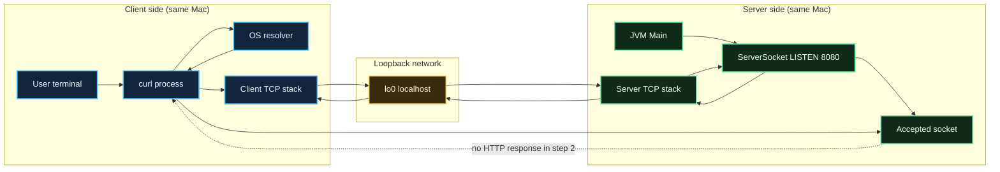
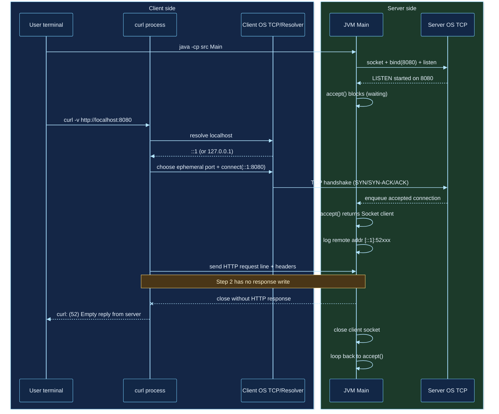

# Java Only HTTP Server 手順書（03）

このファイルは、`03-java-only-http-server` を一つずつ確認しながら進めるための実行手順です。  
各ステップで「やること」と「完了条件」を分けています。

## Step 1: 最小プロジェクトを作る

やること:
- 作業ディレクトリを作る（例: `src`）
- エントリポイント `src/Main.java` を作る
- `main` メソッドだけ先に用意する

例:
```bash
cd /Users/ktoyo/Documents/Web-under-the-hood/03-java-only-http-server
mkdir -p src
touch src/Main.java
```

完了条件:
- `src/Main.java` が存在する
- `javac src/Main.java` が通る（中身が空実装でも可）

---

## Step 2: 8080で待ち受ける

やること:
- `ServerSocket` で `8080` を待ち受ける
- `accept()` できたら接続ログを出す
- まずは無限ループで1接続ずつ処理する

実装ポイント:
- `try (ServerSocket server = new ServerSocket(8080)) { ... }`
- `Socket socket = server.accept();`

実装例（`src/Main.java`）:
```java
import java.io.IOException;
import java.net.ServerSocket;
import java.net.Socket;

public class Main {
    public static void main(String[] args) {
        int port = 8080;

        try (ServerSocket server = new ServerSocket(port)) {
            System.out.println("Server listening on port " + port);

            while (true) {
                try (Socket client = server.accept()) {
                    System.out.println("Accepted: " + client.getRemoteSocketAddress());
                } catch (IOException e) {
                    System.err.println("Failed to handle client: " + e.getMessage());
                }
            }
        } catch (IOException e) {
            System.err.println("Failed to start server: " + e.getMessage());
        }
    }
}
```

確認コマンド:
```bash
cd /Users/ktoyo/Documents/Web-under-the-hood/03-java-only-http-server
javac src/Main.java
java -cp src Main
```

別ターミナル:
```bash
curl -v http://localhost:8080/
```

補足:
- Step 2 ではまだHTTPレスポンスを返していないため、`curl` 側で `Empty reply from server` が出ても正常。
- この時点の確認ポイントは「接続を受けたログがサーバー側に出ること」。

完了条件:
- `java -cp src Main` で起動できる
- `curl http://localhost:8080/` 実行時に「接続を受けた」ログが出る

---

## Step 3: 固定HTTPレスポンスを返す

やること:
- リクエスト内容はまだ読まずに `200 OK` を返す
- ボディは `Hello World`
- `Content-Type` と `Content-Length` を必ず付ける

実装ポイント:
- HTTPヘッダー行は `\r\n` 区切り
- ヘッダー終端は空行（`\r\n\r\n`）
- `Content-Length` はバイト数で計算する

実装例（`src/Main.java`）:
```java
import java.io.IOException;
import java.io.OutputStream;
import java.net.ServerSocket;
import java.net.Socket;
import java.nio.charset.StandardCharsets;

public class Main {
    public static void main(String[] args) {
        int port = 8080;
        String body = "Hello World";
        byte[] bodyBytes = body.getBytes(StandardCharsets.UTF_8);

        String headers =
                "HTTP/1.1 200 OK\r\n" +
                "Content-Type: text/plain; charset=UTF-8\r\n" +
                "Content-Length: " + bodyBytes.length + "\r\n" +
                "Connection: close\r\n" +
                "\r\n";
        byte[] headerBytes = headers.getBytes(StandardCharsets.UTF_8);

        try (ServerSocket server = new ServerSocket(port)) {
            System.out.println("Server listening on port " + port);

            while (true) {
                try (Socket client = server.accept()) {
                    System.out.println("Accepted: " + client.getRemoteSocketAddress());

                    OutputStream out = client.getOutputStream();
                    out.write(headerBytes);
                    out.write(bodyBytes);
                    out.flush();
                } catch (IOException e) {
                    System.err.println("Failed to handle client: " + e.getMessage());
                }
            }
        } catch (IOException e) {
            System.err.println("Failed to start server: " + e.getMessage());
        }
    }
}
```

確認コマンド:
```bash
cd /Users/ktoyo/Documents/Web-under-the-hood/03-java-only-http-server
javac src/Main.java
java -cp src Main
```

別ターミナル:
```bash
curl -v http://localhost:8080/
```

確認ポイント:
- `HTTP/1.1 200 OK`
- `Content-Type: text/plain; charset=UTF-8`
- `Content-Length: 11`
- 本文: `Hello World`

完了条件:
- `curl -v http://localhost:8080/` で `HTTP/1.1 200 OK` が見える
- レスポンス本文に `Hello World` が出る

---

## Step 4: リクエスト行とヘッダーを読む

やること:
- 入力ストリームから1行目（リクエスト行）を読む
- その後、空行が来るまでヘッダーを読み飛ばす
- `method` と `path` を取り出す

実装ポイント:
- 1行目の形式は `GET / HTTP/1.1`
- `String[] parts = requestLine.split(" ");`
- `parts[0]` を method、`parts[1]` を path として扱う

実装例（`src/Main.java` の接続処理部分）:
```java
try (Socket client = server.accept()) {
    System.out.println("Accepted: " + client.getRemoteSocketAddress());

    BufferedReader reader = new BufferedReader(
            new InputStreamReader(client.getInputStream(), StandardCharsets.UTF_8));

    String requestLine = reader.readLine(); // 例: GET / HTTP/1.1
    if (requestLine == null || requestLine.isEmpty()) {
        continue;
    }

    String line;
    while ((line = reader.readLine()) != null && !line.isEmpty()) {
        // Step 4ではヘッダーは読み飛ばすだけ
    }

    String[] parts = requestLine.split(" ");
    String method = parts.length > 0 ? parts[0] : "";
    String path = parts.length > 1 ? parts[1] : "";
    System.out.println("method=" + method + ", path=" + path);

    // Step 4時点ではレスポンスは固定でOK
    OutputStream out = client.getOutputStream();
    out.write(headerBytes);
    out.write(bodyBytes);
    out.flush();
}
```

必要import:
```java
import java.io.BufferedReader;
import java.io.InputStreamReader;
```

確認コマンド:
```bash
cd /Users/ktoyo/Documents/Web-under-the-hood/03-java-only-http-server
javac src/Main.java
java -cp src Main
```

別ターミナル:
```bash
curl -v http://localhost:8080/
curl -v http://localhost:8080/hello
curl -v http://localhost:8080/api/hello
```

確認ポイント:
- サーバーログに `method=GET, path=/...` が出る
- この段階ではどのpathでもレスポンスは固定（Step 5で分岐実装）

完了条件:
- サーバーログに `method` と `path` を出せる
- `curl -v /hello` と `/api/hello` で path の違いがログに出る

---

## Step 5: ルーティングを実装する

やること:
- `GET /` は HTML を返す（`200`）
- `GET /hello` はテキストを返す（`200`）
- `GET /api/hello` は JSON を返す（`200`）
- 上記以外は `404 Not Found` を返す

実装ポイント:
- `if` で `method` と `path` を分岐する
- `Content-Type` を返却内容ごとに変える
- `404` でも `Content-Length` を正しく付ける

実装例（接続処理内の分岐イメージ）:
```java
String status;
String contentType;
String responseBody;

if ("GET".equals(method) && "/".equals(path)) {
    status = "200 OK";
    contentType = "text/html; charset=UTF-8";
    responseBody = "<h1>Welcome</h1><p>Top page</p>";
} else if ("GET".equals(method) && "/hello".equals(path)) {
    status = "200 OK";
    contentType = "text/plain; charset=UTF-8";
    responseBody = "Hello World";
} else if ("GET".equals(method) && "/api/hello".equals(path)) {
    status = "200 OK";
    contentType = "application/json; charset=UTF-8";
    responseBody = "{\"message\":\"Hello API\"}";
} else {
    status = "404 Not Found";
    contentType = "text/plain; charset=UTF-8";
    responseBody = "Not Found";
}

byte[] bodyBytes = responseBody.getBytes(StandardCharsets.UTF_8);
String headers =
        "HTTP/1.1 " + status + "\r\n" +
        "Content-Type: " + contentType + "\r\n" +
        "Content-Length: " + bodyBytes.length + "\r\n" +
        "Connection: close\r\n" +
        "\r\n";

out.write(headers.getBytes(StandardCharsets.UTF_8));
out.write(bodyBytes);
out.flush();
```

確認コマンド:
```bash
curl -v http://localhost:8080/
curl -v http://localhost:8080/hello
curl -v http://localhost:8080/api/hello
curl -v http://localhost:8080/notfound
```

確認ポイント:
- `/` は `200` + `Content-Type: text/html`
- `/hello` は `200` + `Content-Type: text/plain`
- `/api/hello` は `200` + `Content-Type: application/json`
- `/notfound` は `404 Not Found`

完了条件:
- 次の4つの結果が期待どおりになる
```bash
curl -v http://localhost:8080/
curl -v http://localhost:8080/hello
curl -v http://localhost:8080/api/hello
curl -v http://localhost:8080/notfound
```

---

## Step 6: 検証ログを残す

やること:
- エンドポイントごとの `status`、`Content-Type`、本文の要点をメモする
- 正常系（200）と異常系（404）を並べて比較する

主要ヘッダー/要素の役割まとめ:
- `status`（例: `200 OK`, `404 Not Found`）
  - サーバー処理の結果を示す。
  - クライアントはまずここを見て成功/失敗を判定する。
- `Content-Type`（例: `text/plain`, `text/html`, `application/json`）
  - 本文データの種類を示す。
  - クライアントはこの値で本文の解釈方法を決める（文字列表示、HTML描画、JSONとして処理など）。
- `Content-Length`
  - 本文のバイト数を示す。
  - クライアントは「本文をどこまで読むか」をこの値で判断する。
  - 値が不正だと本文欠落や待ち状態などの不具合につながる。
- `Connection: close`
  - レスポンス後に接続を閉じる方針を示す。
  - この学習コードでは1リクエストごとに接続終了するため、挙動が分かりやすい。
- `body`（レスポンス本文）
  - 実際に返したいデータ本体。
  - `Content-Type` と `Content-Length` と整合していることが重要。

完了条件:
- 「どの条件で200/404になるか」を口頭で説明できる
- HTTPレスポンス構造（ステータス行・ヘッダー・本文）を説明できる

---

## 実行コマンド（最低限）

```bash
cd /Users/ktoyo/Documents/Web-under-the-hood/03-java-only-http-server
javac src/Main.java
java -cp src Main
```

別ターミナルで:
```bash
curl -v http://localhost:8080/
curl -v http://localhost:8080/hello
curl -v http://localhost:8080/api/hello
curl -v http://localhost:8080/notfound
```

---

## 補足FAQ（ここまでの質問まとめ）

### Q3. `java -cp src Main` の `-cp` はコピーの意味？

A:
- いいえ。`java` の `-cp` は `class path`（クラス探索パス）の指定。
- 意味は「`src` から `Main.class` を探して実行する」。
- ファイルコピーは一切していない。


### Q5. リッスンしている状態はどう確認する？

A:
- 次のコマンドで確認できる。

```bash
lsof -nP -iTCP:8080 -sTCP:LISTEN
```

- 出力に `java ... TCP *:8080 (LISTEN)` があれば待ち受け中。
- 接続状態まで見るなら `lsof -nP -iTCP:8080`。

### Q6. `Accept: /[0:0:0:0:0:0:0:1]:52201` の数字は何？

A:
- `[0:0:0:0:0:0:0:1]` は `::1`（IPv6 の localhost）。
- `52201` はクライアント（curl 側）の一時ポート。
- サーバーの待ち受けポート `8080` とは別で、接続ごとに変わる。

### Q7. `curl -v` の `-v` は何？

A:
- `--verbose`（詳細表示）。
- DNS 解決、接続先、送信リクエストヘッダー、受信レスポンスヘッダー、接続クローズ理由を表示する。
- HTTP 学習では通信内容の可視化に有効。

---

## 図解（色付き）

補足:
- 仕組み理解と調査観点のQ&Aは `JVM_OS_QA.md` を参照。

### 構成図（Client / Loopback / Server）



### シーケンス図（port占有からEmpty replyまで）


