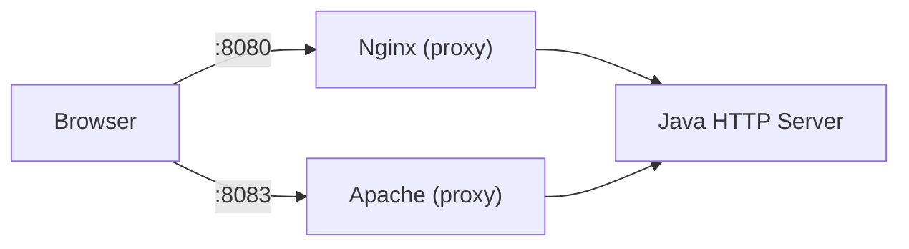

# 04-apache-vs-nginx

## 概要
03で作った同一バックエンド（自作Java HTTPサーバー）に対して、  
ApacheとNginxを「前段リバースプロキシ」として比較する。

## 何を学べるのか
- 両者の設計思想の違い（プロセスモデル/設定思想）
- プロキシ用途での設定差分
- 実務でNginxが選ばれやすい理由と、Apacheが有効な場面

## 使用技術
- Apache
- Nginx
- Docker
- 03のバックエンド（Java `ServerSocket`）
- curl

## 前提
- 01と02の内容（静的配信・Tomcat単体）はここでは繰り返さない
- 03で作ったJavaバックエンド（Java `ServerSocket`）を再利用して比較する

## 構成図（Mermaid）

## なぜこの構成なのか
静的配信の比較は01で学習済みのため、  
ここでは「前段プロキシとしての違い」に焦点を絞るため。

## リクエストの流れ
1. ブラウザは`/api/hello`をNginxまたはApacheへ送る
2. 前段サーバーが同じバックエンドへ中継する
3. 同一条件で設定の書きやすさ・挙動差を比較する

## 触るポイント
- Nginx: `location /api { proxy_pass ...; }`
- Apache: `ProxyPass /api ...` / `ProxyPassReverse /api ...`
- ヘッダー転送（`Host`, `X-Forwarded-For`, `X-Forwarded-Proto`）
- ログ形式と見やすさ

## よくある失敗
- Apacheで`mod_proxy`系モジュール有効化漏れ
- パスの付け替えミスで`/api`が二重化/欠落
- `Host`ヘッダー未考慮でアプリ側判定が崩れる

## 実務との対応
- 既存Apache資産がある現場での移行判断
- Nginxを入口に寄せる理由（構成の単純化、性能特性）
- どちらも「前段として成立する」ことの確認

## 次にやるなら
- 05でネットワーク観測を行い、実際の経路と障害切り分けを身につける
