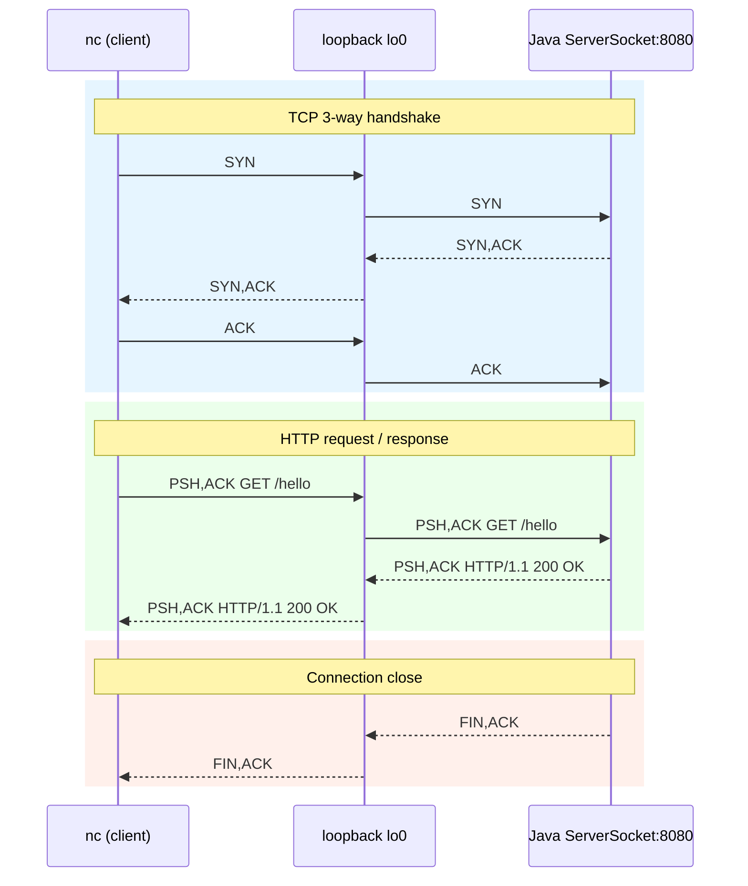

# Wiresharkとncで分解するTCP/HTTPの流れ（localhost:8080）

## この記事で伝えたいこと
- `nc` で手入力したHTTPリクエストが、TCP上でどう運ばれるかを観測ベースで理解する
- `SYN/SYN-ACK/ACK`（接続確立）や`RST`（接続拒否）を切り分けられるようにする
- 「TCPクライアント」と「HTTPクライアント」の役割差を、実パケットで説明できる状態を目指す

## 想定読者
- `localhost:8080` の通信をレイヤーごとに理解したい人
- Wiresharkを使い始めたばかりで、どこを見ればよいか迷う人
- 障害切り分けの基礎（200/404/RST）を実験で掴みたい人

## 完成イメージ



## 使用技術
- Java 17（`ServerSocket`, `Socket`）
- Wireshark（`lo0`観測）
- `nc`（netcat）

## 実装
### 1. 最小HTTPサーバーを起動する

まずは任意の作業ディレクトリに `src/Main.java` を置いて起動する。  
このサンプルは「接続直後には返さず、HTTPリクエスト行とヘッダー終端を読んでから返す」構成。

```bash
javac src/Main.java
java -cp src Main
```

`src/Main.java`（そのまま使用可）:

```java
import java.io.BufferedReader;
import java.io.IOException;
import java.io.InputStreamReader;
import java.io.OutputStream;
import java.net.ServerSocket;
import java.net.Socket;
import java.nio.charset.StandardCharsets;

public class Main {
    public static void main(String[] args) {
        int port = 8080;

        try (ServerSocket server = new ServerSocket(port)) {
            System.out.println("Server listening on port " + port);
            while (true) {
                try (Socket client = server.accept()) {
                    System.out.println("Accepted: " + client.getRemoteSocketAddress());

                    BufferedReader reader = new BufferedReader(
                        new InputStreamReader(client.getInputStream(), StandardCharsets.UTF_8)
                    );

                    String requestLine = reader.readLine();
                    if (requestLine == null || requestLine.isEmpty()) {
                        continue;
                    }

                    String line;
                    while ((line = reader.readLine()) != null && !line.isEmpty()) {
                    }

                    String[] parts = requestLine.split(" ");
                    String method = parts.length > 0 ? parts[0] : "";
                    String path = parts.length > 1 ? parts[1] : "";
                    System.out.println("method=" + method + ", path=" + path);

                    String status;
                    String responseBody;
                    if ("GET".equals(method) && "/hello".equals(path)) {
                        status = "200 OK";
                        responseBody = "Hello World";
                    } else {
                        status = "404 Not Found";
                        responseBody = "Not Found";
                    }

                    byte[] bodyBytes = responseBody.getBytes(StandardCharsets.UTF_8);
                    String headers =
                        "HTTP/1.1 " + status + "\r\n" +
                        "Content-Type: text/plain; charset=UTF-8\r\n" +
                        "Content-Length: " + bodyBytes.length + "\r\n" +
                        "Connection: close\r\n" +
                        "\r\n";

                    OutputStream out = client.getOutputStream();
                    out.write(headers.getBytes(StandardCharsets.UTF_8));
                    out.write(bodyBytes);
                    out.flush();
                } catch (IOException e) {
                    System.err.println("Failed to handle client: " + e.getMessage());
                }
            }
        } catch (IOException e) {
            System.err.println("Failed to start server: " + e.getMessage());
        }
    }
}
```

ポイント:
- `GET /hello` は `200 OK`
- それ以外（例: `POST /hello`, `GET /notfound`）は `404 Not Found`

このコードでしていること（ブロックごと）:

1. 待受ポートの準備
```java
int port = 8080;
try (ServerSocket server = new ServerSocket(port)) {
```
- `8080`で待受ソケットを作る。
- ここでサーバープロセスは接続待ち状態に入る。

2. 接続ごとの処理ループ
```java
while (true) {
    try (Socket client = server.accept()) {
```
- `accept()`は接続要求が来るまで待つ（ブロック）。
- 接続成立後、そのクライアント専用`Socket`を受け取る。

3. 受信ストリームを読みやすい形に変換
```java
BufferedReader reader = new BufferedReader(
    new InputStreamReader(client.getInputStream(), StandardCharsets.UTF_8)
);
```
- ソケットの生バイト入力をUTF-8文字列として読めるようにする。
- `readLine()`でHTTPの1行ずつを読める状態を作る。

4. リクエスト行を読む
```java
String requestLine = reader.readLine();
if (requestLine == null || requestLine.isEmpty()) {
    continue;
}
```
- 例: `GET /hello HTTP/1.1` を受信する。
- 空入力や切断時は次の接続へ進む。

5. ヘッダー終端まで読み進める
```java
String line;
while ((line = reader.readLine()) != null && !line.isEmpty()) {
}
```
- 空行（CRLF CRLF）まで読み進める。
- これでHTTPヘッダーの読み取り範囲を確定する。

6. method/pathを取り出す
```java
String[] parts = requestLine.split(" ");
String method = parts.length > 0 ? parts[0] : "";
String path = parts.length > 1 ? parts[1] : "";
System.out.println("method=" + method + ", path=" + path);
```
- リクエスト行を空白で分割して、メソッドとパスを取り出す。
- ログ出力して受信内容を確認する。

7. ルーティングしてレスポンス内容を決める
```java
if ("GET".equals(method) && "/hello".equals(path)) {
    status = "200 OK";
    responseBody = "Hello World";
} else {
    status = "404 Not Found";
    responseBody = "Not Found";
}
```
- `GET /hello` のみ成功レスポンス。
- それ以外は404に分岐する。

8. HTTPレスポンスを組み立てる
```java
byte[] bodyBytes = responseBody.getBytes(StandardCharsets.UTF_8);
String headers =
    "HTTP/1.1 " + status + "\r\n" +
    "Content-Type: text/plain; charset=UTF-8\r\n" +
    "Content-Length: " + bodyBytes.length + "\r\n" +
    "Connection: close\r\n" +
    "\r\n";
```
- ステータス行・ヘッダー・本文長を作る。
- `Content-Length`は本文バイト数と一致させる。

9. クライアントへ送信する
```java
OutputStream out = client.getOutputStream();
out.write(headers.getBytes(StandardCharsets.UTF_8));
out.write(bodyBytes);
out.flush();
```
- ヘッダーと本文を順に送信する。
- `flush()`でバッファを即時送信する。

### 2. Wiresharkでキャプチャする

- インターフェース: `Loopback: lo0`
- 表示フィルタ: `tcp.port == 8080`

注意:
- `localhost` / `127.0.0.1` 通信は `lo0` に出る
- `Wi-Fi: en0` を見ていると今回の通信は基本的に見えない

### 3. `nc` でHTTPを手入力する

```bash
nc 127.0.0.1 8080
```

入力（最後に空行必須）:

```http
GET /hello HTTP/1.1
Host: localhost:8080
Connection: close

```

レスポンス例:

```http
HTTP/1.1 200 OK
Content-Type: text/plain; charset=UTF-8
Content-Length: 11
Connection: close

Hello World
```

### 3.5 3-way handshake（接続確立）を確認する

`nc 127.0.0.1 8080` を実行した直後、HTTPが流れる前にTCP接続確立が行われる。

順序:
1. `SYN`（クライアント -> サーバー）  
   - 接続開始要求
2. `SYN, ACK`（サーバー -> クライアント）  
   - 要求を受け取ったことと、サーバー側も接続可能であることを通知
3. `ACK`（クライアント -> サーバー）  
   - 応答を受け取ったことを伝えて接続確立

この3ステップが成立して初めて、HTTPリクエスト（`GET /hello HTTP/1.1`）が流れる。

### 4. 正常系パケットを対応づける

典型的な並び:
1. `SYN`（クライアント -> サーバー）
2. `SYN, ACK`（サーバー -> クライアント）
3. `ACK`（接続確立完了）
4. `PSH, ACK`（HTTPリクエスト送信）
5. `HTTP/1.1 200 OK`（HTTPレスポンス）
6. `FIN, ACK` 往復（接続終了）

補足:
- `Follow TCP Stream` で、送受信HTTPテキストを1本で確認できる

### 5. 404系を確認する

同様に接続して以下を送る:

```http
GET /notfound HTTP/1.1
Host: localhost:8080
Connection: close

```

期待結果:
- `HTTP/1.1 404 Not Found`
- サーバーログ: `method=GET, path=/notfound`

### 6. 接続拒否（RST）を確認する

サーバー停止後に実行:

```bash
nc 127.0.0.1 8080
```

Wiresharkでの典型:
1. `SYN`
2. `RST, ACK`

意味:
- `8080` で待ち受けプロセスがいないため、接続を即時拒否
- 3-way handshake は成立しない

## レイヤー整理（短く）
- TCP（L4）: 接続・順序保証・再送
- HTTP（L7）: リクエスト/レスポンスの意味
- 今回の `nc` はTCPクライアント。HTTP文字列はユーザーが手入力している
つまり、TCP接続（3-way handshake）が成立してから、HTTPメッセージ（文字列）がTCPコネクション上を流れるようになる。

## まとめ
今回の実験で確認できるのは次の3点。
- HTTPはTCPの上で動く（接続確立後にHTTPが流れる）
- 正常終了（FIN）と接続拒否（RST）は明確に見分けられる
- `nc + Wireshark` で、アプリ挙動とネットワーク挙動を対応づけて説明できる
