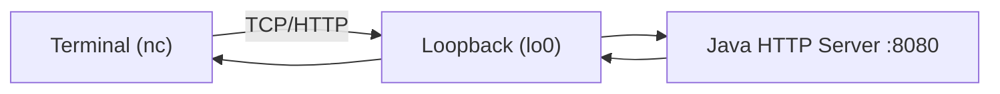

# 04-wireshark-local-http

## 概要
03で作ったDockerを使わない最小HTTPサーバーをそのまま使い、  
WiresharkでTCP/HTTP通信の全体像を観測する。

## 何を学べるのか
- ループバック通信（`localhost`/`127.0.0.1`）の実体
- TCP 3-way handshakeとHTTPレスポンスの対応
- 接続失敗時（RST/タイムアウト）の見え方
- アプリログとパケットログの突き合わせ

## 使用技術
- 03のJava HTTPサーバー（`ServerSocket`）
- Wireshark
- `nc`（netcat）

## 関連ドキュメント
- 実行手順: `SETUP_STEPS.md`
- `nc`実行から切断までの時系列: `FLOW_NC_TO_CLOSE.md`
- TCPクライアント/HTTPクライアントとレイヤー整理: `LAYERS_AND_CLIENTS.md`
- Wireshark確認ポイント（正常系/異常系）: `WIRESHARK_CHECKPOINTS.md`

## 前提
- `03-java-only-http-server` が動作していること
- ここではDockerを使わない
- `curl`は補助確認に留め、主に`nc`でHTTPリクエストを手入力する

## 構成図（Mermaid）


## なぜこの構成なのか
プロキシやDockerを挟む前に、最小HTTP通信そのものを観測対象にするため。  
責務を増やさないことで、パケットとアプリ動作の対応を1対1で説明できる。

## 学習ステップ（04）

### 4-1. Wiresharkでループバックをキャプチャする
やること:
- ループバックインターフェース（macOS: `lo0`）を選択
- 表示フィルタを `tcp.port == 8080` に設定

目的:
- 03サーバーに関係するパケットだけを追える状態を作る

### 4-2. `nc`でHTTP/1.1リクエストを手入力する
やること:
- ターミナルから `nc 127.0.0.1 8080` で接続
- 以下を手入力して送信する

```http
GET /hello HTTP/1.1
Host: localhost:8080
Connection: close

```

目的:
- HTTPが「文字列プロトコル」であることを自分の入力で確認する

### 4-3. パケットとレスポンスを突き合わせる
やること:
- SYN -> SYN/ACK -> ACK を確認
- リクエスト送信パケットとレスポンス（`HTTP/1.1 200`）を対応づける
- `404`パス（例: `/notfound`）も同様に確認

目的:
- アプリの分岐結果がネットワーク上でどう現れるか説明できるようにする

### 4-4. 失敗系を再現して観測する
やること:
- サーバー停止状態で `nc 127.0.0.1 8080` を実行
- 接続拒否（RST）や失敗の出方を確認

目的:
- 「つながらない」をパケット事実で切り分けられるようにする

## 触るポイント
- Wireshark表示フィルタ: `tcp.port == 8080`
- Follow TCP StreamでHTTPテキストを確認
- Java側ログ時刻とパケット時刻の対応

## よくある失敗
- `nc`で空行を送らず、リクエスト完了にならない
- `Host`ヘッダー不足で意図しない挙動になる
- Wiresharkでループバック以外を見てしまい、パケットが見えない

## 実務との対応
- 障害一次切り分け（アプリ起因かネットワーク起因か）
- 証拠ベースでの説明（ログだけでなくパケットで裏付け）
- プロキシ導入前の基礎通信理解

## 次にやるなら
- 05で同じバックエンドにApache/Nginxを前段配置し、リバースプロキシ差分を比較する
