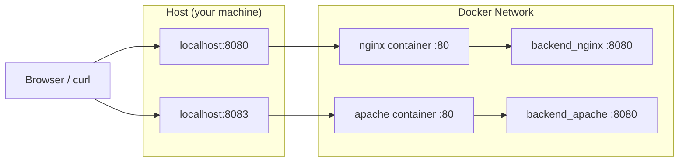

# QA_MEMO_APACHE_NGINX

このメモは、`05-apache-vs-nginx` の作業中に出た疑問を整理したもの。  
各項目は「疑問点」と「こういう意味らしい」で記録する。

## 1. Docker Composeの設定項目

### 1-1. `volumes` は何のために使う？
疑問点:
- 「`volumes` はどんな役割？」

こういう意味らしい:
- ホストとコンテナ間、またはコンテナ内データを永続化するための仕組み。
- 主な用途は次の3つ。
  - ソースコード/設定ファイルのマウント
  - DBなどのデータ永続化
  - コンテナ再作成後も残したいデータの保持
- 例: `./nginx/default.conf:/etc/nginx/conf.d/default.conf:ro`
  - ホスト側の設定ファイルをコンテナへ読み取り専用で渡す。

### 1-2. `expose` は何のために使う？
疑問点:
- 「`expose` はどんな役割？」

こういう意味らしい:
- コンテナのポートを、同じDockerネットワーク内の他コンテナ向けに公開する宣言。
- ホスト（`localhost`）には公開しない。
- 外部公開が必要な場合は `ports` を使う。

### 1-3. `ports` と `expose` の違いは？
疑問点:
- 「`ports` があれば `expose` は要る？」

こういう意味らしい:
- `ports`: `ホスト:コンテナ` で外部公開する。
- `expose`: コンテナ間通信向けの内部公開（主にドキュメント的な意味合い）。
- Composeの同一ネットワークでは、`expose` を書かなくてもサービス名宛に通信できるケースが多い。

## 2. ポート競合時の確認

### 2-1. 8080/8083が使えないときは？
疑問点:
- 「既存プロセスがポートを掴んでいるときの確認方法は？」

こういう意味らしい:
- `lsof` で待受プロセスを確認し、必要に応じて停止する。

確認コマンド:
```bash
lsof -nP -iTCP:8080 -sTCP:LISTEN
lsof -nP -iTCP:8083 -sTCP:LISTEN

# 必要な場合のみ
kill <PID>
```

## 3. Javaソケット送信

### 3-1. `flush` は何をしている？
疑問点:
- 「`flush` って何？」

こういう意味らしい:
- `OutputStream` の送信バッファに溜まっているデータを、即時に相手へ送る処理。
- `write()` しただけでは送信が遅延する場合があるため、HTTPレスポンス送信時は `flush()` で明示的に押し出す。
- ソケット通信では `flush()` しないと、相手がレスポンスを待ち続ける原因になることがある。

## 4. Javaの読み取り型

### 4-1. `BufferedReader` は何をする型？
疑問点:
- 「`BufferedReader` って何をする型？」

こういう意味らしい:
- 文字入力をバッファして効率よく読むための `Reader` ラッパー。
- `readLine()` を使って1行単位で読み取れる。
- HTTPではリクエスト行やヘッダーを行単位で読む用途で使う。

### 4-2. `InputStreamReader` は何？
疑問点:
- 「`InputStreamReader` は何？」

こういう意味らしい:
- `InputStream`（生バイト）を `Reader`（文字入力）に変換する型。
- 文字コード（例: `UTF-8`）を指定して、バイト列を文字列として読めるようにする。
- 典型的には `BufferedReader` と組み合わせて使う。

### 4-3. `requestLine.split(" ")` では何を処理している？
疑問点:
- 「`String[] parts = requestLine.split(" ");` などは、具体的にどんな文字列を処理している？」

こういう意味らしい:
- HTTPリクエストの1行目（リクエストライン）を処理している。
- 例: `GET /api/hello HTTP/1.1`
- 空白で分割すると以下になる。
  - `parts[0] = "GET"`（method）
  - `parts[1] = "/api/hello"`（path）
  - `parts[2] = "HTTP/1.1"`（protocol）
- `parts.length > 0 ? parts[0] : ""` は、要素不足時の例外回避のための安全策。

### 4-4. `responseBody.getBytes(StandardCharsets.UTF_8)` は何をしている？
疑問点:
- 「これは文字列をバイト数に変換するメソッド？」

こういう意味らしい:
- 文字列そのものを、UTF-8でエンコードした `byte[]`（バイト配列）に変換する処理。
- 戻り値は「数値（バイト数）」ではなく「実際に送信するバイト列」。
- バイト数が必要な場合は、その配列の `length` を使う（例: `bodyBytes.length`）。
- HTTPレスポンスでは `Content-Length` に `bodyBytes.length` を設定するために使う。

## 5. Nginx / Apache プロキシ設定

### 5-1. Nginxのリバースプロキシはどこにつながる？
疑問点:
- 「`location /api/` の転送先はどこ？」

こういう意味らしい:
- `proxy_pass http://backend_nginx:8080/;` なので、Composeネットワーク内の `backend_nginx` サービスへ転送する。
- 例: `GET /api/hello` はバックエンド側に `/hello` として渡る（`proxy_pass` 末尾 `/` のため）。

### 5-2. `proxy_pass` とは？
疑問点:
- 「`proxy_pass` は何？」

こういう意味らしい:
- Nginxで「このリクエストをどの上流サーバーへ中継するか」を指定するディレクティブ。
- `location` にマッチしたリクエストを、指定先（例: `backend_nginx:8080`）へ転送してレスポンスを返す。
- 末尾 `/` の有無でパス変換の挙動が変わるため注意が必要。

### 5-4. Apacheの `httpd.conf` は何をしている？
疑問点:
- 「Apache側のconf設定の意味は？」

こういう意味らしい:
- `ServerName localhost` / `Listen 80`: Apacheの基本設定（コンテナ内80番待受）。
- `LoadModule ...`: 必要モジュールを有効化。特に `mod_proxy` / `mod_proxy_http` / `mod_headers` が重要。
- `ErrorLog` / `CustomLog`: コンテナ標準出力・標準エラーへログを出す設定。
- `ProxyPreserveHost On`: 元の `Host` ヘッダーをバックエンドへ引き継ぐ。
- `RequestHeader set X-Forwarded-Proto \"http\"`: 元スキーム情報をバックエンドへ渡す。
- `ProxyPass \"/api/\" \"http://backend_apache:8080/\"`: `/api/` をバックエンドへ中継。
- `ProxyPassReverse ...`: バックエンド由来の戻り先URL（`Location` など）を整合する。

### 5-5. なぜApacheからNginx利用が増えた？
疑問点:
- 「なぜ前段でNginxを使うケースが増えたのか？」

こういう意味らしい:
- 高同時接続時に、Nginxのイベント駆動モデルは少ないプロセスで捌きやすく、前段用途で効率が出やすい。
- リバースプロキシ、SSL終端、静的配信、ロードバランスをシンプルにまとめやすい。
- クラウド/コンテナ環境で軽量な入口として運用しやすく、採用が広がった。
- 実務では「Apache資産は残しつつ入口はNginx」という移行パターンが増えた。
- これはApacheが不要になったというより、システム構成の重心が前段プロキシ中心へ移った影響が大きい。

### 5-6. 8080/8083 と内部転送の流れ（図と説明）
疑問点:
- 「この構成で、リクエストはどの順番で流れる？」

こういう意味らしい:


- ブラウザ（または`curl`）から、ホストの`localhost:8080`または`localhost:8083`にアクセスする。
- `localhost:8080`に来たリクエストは、Docker内の`nginx`コンテナ（`:80`）に入る。
- `nginx`はそのリクエストを`backend_nginx:8080`へ中継する。
- `localhost:8083`に来たリクエストは、Docker内の`apache`コンテナ（`:80`）に入る。
- `apache`はそのリクエストを`backend_apache:8080`へ中継する。
- つまり入口は2つ（8080/8083）だが、最終的にはそれぞれのバックエンド（8080）で処理する。


## 比較表（今回の実装ベース）

| 比較ポイント | Nginx（今回） | Apache（今回） | 見るべきファイル |
|---|---|---|---|
| ホスト公開ポート | `8080:80` | `8083:80` | `docker-compose.yml` |
| プロキシ設定の書き方 | `location /api/` + `proxy_pass` | `ProxyPass` + `ProxyPassReverse` | `nginx/default.conf`, `apache/httpd.conf` |
| `/` への応答 | Nginxが固定 `200` を直接返す | 今回は`/api/`のみ中継対象 | `nginx/default.conf` |
| `/api/hello` の中継先 | `backend_nginx:8080` | `backend_apache:8080` | 各conf |
| ヘッダー転送 | `proxy_set_header` で明示 | `ProxyPreserveHost` + `RequestHeader` | 各conf |
| 起動に必要な注意点 | `default.conf` のマウント先が正しいか | `mod_proxy` / `mod_proxy_http` 読み込みがあるか | 各conf |
| バックエンド実装 | Java最小HTTPサーバー（`GET /hello`のみ200） | 同じ実装を別サービスで起動 | `backend-nginx/src/Main.java`, `backend-apache/src/Main.java` |


