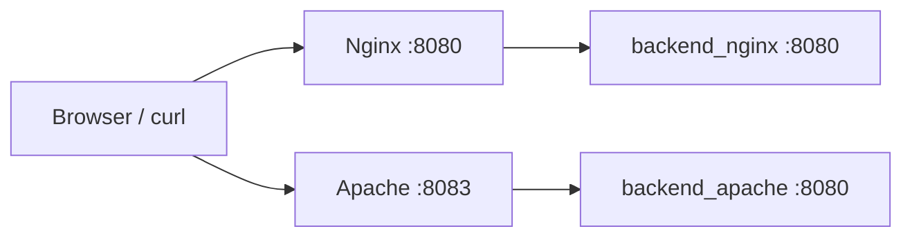

# ApacheとNginxを前段プロキシとして比較する（分離バックエンド構成）

## この記事で伝えたいこと
- ApacheとNginxを「前段リバースプロキシ」として同条件で比較する構成を作る
- バックエンドを2つに分離したときの検証しやすさを体感する
- Javaの最小HTTPサーバー実装で、`method/path` 解析とレスポンス返却の流れを確認する

## 想定読者
- Apache/Nginxをどちらも触りたいが、まずはローカルで比較したい人
- `proxy_pass` と `ProxyPass` の違いを実験で理解したい人
- Javaソケット実装の最小構成を復習したい人

## 完成イメージ



## 使用技術
- Java 17（`ServerSocket`, `Socket`）
- Nginx
- Apache httpd
- Docker Compose
- curl

## 実装
### 1. ディレクトリを作る

```bash
cd /Users/ktoyo/Documents/Web-under-the-hood/05-apache-vs-nginx
mkdir -p backend-nginx/src backend-apache/src nginx apache
```

### 2. `backend-nginx/src/Main.java` を作る

最小実装のポイント:
- `ServerSocket(8080)` で待受
- `accept()` で接続ごとに処理
- `requestLine.split(" ")` で `method/path` を取得
- `GET /hello` は `200`、それ以外は `404`
- `Content-Length` を本文バイト長で設定
- `out.flush()` で送信バッファを確実に流す

コンパイル・実行:

```bash
cd /Users/ktoyo/Documents/Web-under-the-hood/05-apache-vs-nginx/backend-nginx
javac src/Main.java
java -cp src Main
```

### 3. Composeで4サービス構成にする

```yaml
services:
  backend_nginx:
    build:
      context: ./backend-nginx

  backend_apache:
    build:
      context: ./backend-apache

  nginx:
    image: nginx:1.27-alpine
    depends_on:
      - backend_nginx
    ports:
      - "8080:80"
    volumes:
      - ./nginx/default.conf:/etc/nginx/conf.d/default.conf:ro

  apache:
    image: httpd:2.4
    depends_on:
      - backend_apache
    ports:
      - "8083:80"
    volumes:
      - ./apache/httpd.conf:/usr/local/apache2/conf/httpd.conf:ro
```

### 4. プロキシ設定を書く

Nginx:
- `location /api/ { proxy_pass http://backend_nginx:8080/; }`

Apache:
- `ProxyPass "/api/" "http://backend_apache:8080/"`
- `ProxyPassReverse "/api/" "http://backend_apache:8080/"`

### 5. 動作確認

```bash
cd /Users/ktoyo/Documents/Web-under-the-hood/05-apache-vs-nginx
docker compose up -d --build

docker compose ps
curl -i http://localhost:8080/api/hello
curl -i http://localhost:8083/api/hello
curl -i http://localhost:8080/api/notfound
curl -i http://localhost:8083/api/notfound
```

## 実装時に整理したポイント（Q&A）
- `volumes`: 設定ファイルやデータのマウント/永続化に使う
- `expose`: コンテナ間向けの内部公開（ホストには出ない）
- `flush()`: 送信バッファを即時送出する
- `BufferedReader`: 行単位で読みやすくする
- `InputStreamReader`: バイト入力を文字入力に変換する
- `requestLine.split(" ")`: `GET /api/hello HTTP/1.1` を分解して `method/path` を取得する
- `getBytes(UTF_8)`: 文字列をバイト配列に変換し、`Content-Length` は `byte[].length` で求める

## 詰まりやすい点
- `BufferedReader(...)` の括弧/セミコロン崩れでコンパイルエラー
- `Content-Length` を付け忘れてレスポンス解釈が不安定になる
- 404なのに `400 Not Found` と書いてしまう（ステータスの不整合）
- `8080/8083` が既存プロセスで使用中

ポート競合確認:

```bash
lsof -nP -iTCP:8080 -sTCP:LISTEN
lsof -nP -iTCP:8083 -sTCP:LISTEN
```

## まとめ
- Apache/Nginx比較は、プロキシ先バックエンドを分けると切り分けしやすい
- Java最小HTTP実装では、`request line` 解析と `Content-Length` の整合が重要
- 小さい差分（括弧、ステータスコード、`flush`）が動作不良に直結する
