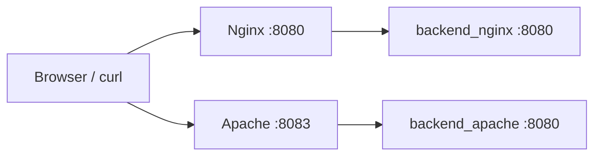
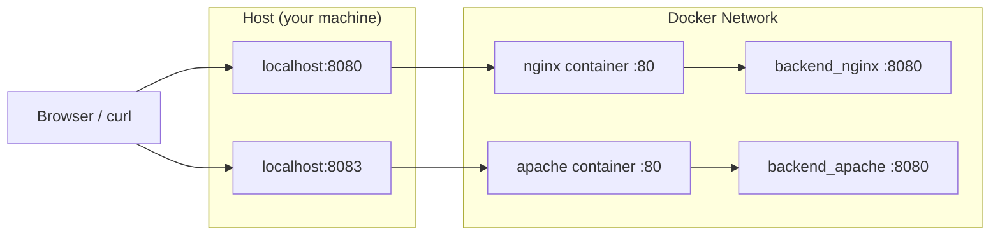

# ApacheとNginxを前段プロキシとして比較する（バックエンド分離構成）

## この記事で伝えたいこと
- ApacheとNginxを「前段リバースプロキシ」として、同じ条件で比較できる構成を作る
- Javaの最小HTTPサーバー実装で、`method/path` 解析とレスポンス返却の流れを手で追えるようにする

## 想定読者
- Apache/Nginxをどちらも触りたいが、まずはローカルで比較したい人
- Javaソケット実装の最小構成を復習したい人

## 完成イメージ



## 使用技術
- Java 17（`ServerSocket`, `Socket`）
- Nginx
- Apache httpd
- Docker Compose
- curl

## 実装
### 1. ディレクトリを作る

```bash
cd 05-apache-vs-nginx
mkdir -p backend-nginx/src backend-apache/src nginx apache
```

### 2. `backend-nginx/src/Main.java` を作る

最小実装のポイント:
- `ServerSocket(8080)` で待受
- `accept()` で接続ごとに処理
- `requestLine.split(" ")` で `method/path` を取得
- `GET /hello` は `200`、それ以外は `404`
- `Content-Length` を本文バイト長で設定
- `out.flush()` で送信バッファを確実に流す

補足:
- 比較条件を揃えるため、`backend-nginx/src/Main.java` と `backend-apache/src/Main.java` は同じ実装にしています。
- 差分は前段プロキシ設定（Nginx / Apache）側だけで見ます。

`backend-nginx/src/Main.java`:
```java
import java.io.BufferedReader;
import java.io.IOException;
import java.io.InputStreamReader;
import java.io.OutputStream;
import java.net.ServerSocket;
import java.net.Socket;
import java.nio.charset.StandardCharsets;

public class Main {
	public static void main(String [] args) {
		int port = 8080;

		try (ServerSocket server = new ServerSocket(port)) {
			System.out.println("Server listening on port: " + port);

			while (true) {
				try (Socket client = server.accept()) {
					BufferedReader reader = new BufferedReader(
						new InputStreamReader(client.getInputStream(), StandardCharsets.UTF_8)
					);

					String requestLine = reader.readLine();
					if (requestLine == null || requestLine.isEmpty()) {
						continue;
					}

					String line;
					while ((line = reader.readLine()) != null && !line.isEmpty()) {
					}

					String[] parts = requestLine.split(" ");
					String method = parts.length > 0 ? parts[0] : "";
					String path = parts.length > 1 ? parts[1] : "";

					String status;
					String contentType;
					String responseBody;

					if ("GET".equals(method) && "/hello".equals(path)) {
						status = "200 OK";
						contentType = "text/plain; charset=UTF-8";
						responseBody = "Hello World";
					} else {
						status = "404 Not Found";
						contentType = "text/plain; charset=UTF-8";
						responseBody = "Not Found";
					}

					byte[] bodyBytes = responseBody.getBytes(StandardCharsets.UTF_8);
					String headers = 
						"HTTP/1.1 " + status + "\r\n" +
						"Content-Type: " + contentType + "\r\n" +
						"Content-Length: " + bodyBytes.length + "\r\n" +
						"Connection: close\r\n" +
						"\r\n";

					OutputStream out = client.getOutputStream();
					out.write(headers.getBytes(StandardCharsets.UTF_8));
					out.write(bodyBytes);
					out.flush();
				} catch (IOException e) {
					System.err.println("Failed to handle client: " + e.getMessage());
				}
			}
		} catch (IOException e) {
			System.err.println("Failed to start server: " + e.getMessage());
		}
	}
}
```

`backend-apache/src/Main.java`:
```java
import java.io.InputStreamReader;
import java.io.OutputStream;
import java.io.BufferedReader;
import java.net.ServerSocket;
import java.net.Socket;
import java.nio.charset.StandardCharsets;
import java.io.IOException;

public class Main {
	public static void main(String[] args) {
		int port = 8080;

		try (ServerSocket server = new ServerSocket(port)) {
			System.out.println("Server listening on port: " + port);

			while(true) {
				try (Socket client = server.accept()) {
					BufferedReader reader = new BufferedReader(
						new InputStreamReader(client.getInputStream(), StandardCharsets.UTF_8)
					);

					String requestLine = reader.readLine();
					if (requestLine == null || requestLine.isEmpty()) {
						continue;
					}

					String line;
					while ((line = reader.readLine()) != null && !line.isEmpty()) {
					}
					
					String[] parts = requestLine.split(" ");
					String method = parts.length > 0 ? parts[0] : "";
					String path = parts.length > 1 ? parts[1] : "";

					String status;
					String contentType;
					String responseBody;

					if ("GET".equals(method) && "/hello".equals(path)) {
						status = "200 OK";
						contentType = "text/plain; charset=UTF-8";
						responseBody = "Hello World";
					} else {
						status = "404 Not Found";
						contentType = "text/plain; charset=UTF-8";
						responseBody = "Not Found";
					}

					byte[] bodyBytes = responseBody.getBytes(StandardCharsets.UTF_8);
					String headers = 
						"HTTP/1.1 " + status + "\r\n" +
						"Content-Type: " + contentType + "\r\n" +
						"Content-Length: " + bodyBytes.length + "\r\n" +
						"Connection: close\r\n" +
						"\r\n";

					OutputStream output = client.getOutputStream();
					output.write(headers.getBytes(StandardCharsets.UTF_8));
					output.write(bodyBytes);
					output.flush();
				} catch(IOException e) {
					System.err.println("Failed to handle client: " + e.getMessage());
				}
			}
		} catch(IOException e) {
			System.err.println("Failed to start server: " + e.getMessage());
		}
	}
}
```

この実装で使っている処理の意味:
- `BufferedReader`: 受信データを行単位で読みやすくするために使っています。
- `InputStreamReader`: ソケットから来るバイト入力を文字入力へ変換しています（UTF-8指定）。
- `requestLine.split(" ")`: `GET /api/hello HTTP/1.1` のようなリクエストラインを分解し、`method/path` を取り出しています。
- `getBytes(StandardCharsets.UTF_8)`: レスポンス本文をバイト配列に変換し、`Content-Length` を正しく計算するために使っています。
- `flush()`: 送信バッファを即時に相手へ流し、レスポンスを確実に返すために使っています。

コンパイル・実行:

```bash
cd backend-nginx
javac src/Main.java
java -cp src Main
```

### 3. Composeで4サービス構成にする

```yaml
services:
  backend_nginx:
    build:
      context: ./backend-nginx

  backend_apache:
    build:
      context: ./backend-apache

  nginx:
    image: nginx:1.27-alpine
    depends_on:
      - backend_nginx
    ports:
      - "8080:80"
    volumes:
      - ./nginx/default.conf:/etc/nginx/conf.d/default.conf:ro

  apache:
    image: httpd:2.4
    depends_on:
      - backend_apache
    ports:
      - "8083:80"
    volumes:
      - ./apache/httpd.conf:/usr/local/apache2/conf/httpd.conf:ro
```

この `docker-compose.yml` では、前段2つ（`nginx` と `apache`）と、バックエンド2つ（`backend_nginx` と `backend_apache`）を同じネットワーク上で起動しています。  
ホスト公開は前段だけにしており、`nginx` は `8080:80`、`apache` は `8083:80` で受けています。  
バックエンドは外部公開せず、前段からサービス名で内部接続する構成です。  
また、`volumes` で各プロキシの設定ファイル（`default.conf` / `httpd.conf`）を読み取り専用で渡しています。

### 4. プロキシ設定を書く

`nginx/default.conf`:

```nginx
server {
    listen 80;
    server_name _;

    location = / {
        return 200 'nginx proxy is running\n';
        add_header Content-Type text/plain;
    }

    location /api/ {
        proxy_pass http://backend_nginx:8080/;
        proxy_http_version 1.1;

        proxy_set_header Host $host;
        proxy_set_header X-Forwarded-For $proxy_add_x_forwarded_for;
        proxy_set_header X-Forwarded-Proto $scheme;
    }
}
```

`nginx/default.conf` は、Nginxを「入口」として使うための最小設定です。  
`/` へのアクセスはNginx自身が直接 `200` を返し、起動確認ができるようにしています。  
一方で `/api/` 配下は `backend_nginx:8080` に中継し、実際の処理はバックエンド側に寄せています。  
あわせて `Host` や `X-Forwarded-*` を転送し、バックエンドで元リクエスト情報を参照できるようにしています。

`X-Forwarded-*` は、プロキシがバックエンドへ渡す「元のリクエスト情報」です。  
代表例として `X-Forwarded-For` は元クライアントIP、`X-Forwarded-Proto` は元のスキーム（http/https）を表します。  
プロキシを挟むと接続元がプロキシに見えるため、アプリ側で元情報を参照したい場合に重要になります。

`apache/httpd.conf`:

```apache
ServerName localhost
Listen 80

LoadModule mpm_event_module modules/mod_mpm_event.so
LoadModule authn_core_module modules/mod_authn_core.so
LoadModule authz_core_module modules/mod_authz_core.so
LoadModule unixd_module modules/mod_unixd.so
LoadModule dir_module modules/mod_dir.so
LoadModule log_config_module modules/mod_log_config.so
LoadModule mime_module modules/mod_mime.so
LoadModule headers_module modules/mod_headers.so
LoadModule proxy_module modules/mod_proxy.so
LoadModule proxy_http_module modules/mod_proxy_http.so

User daemon
Group daemon

ServerAdmin you@example.com
DocumentRoot "/usr/local/apache2/htdocs"

<Directory "/usr/local/apache2/htdocs">
    AllowOverride None
    Require all granted
</Directory>

ErrorLog /proc/self/fd/2
CustomLog /proc/self/fd/1 combined

ProxyPreserveHost On
RequestHeader set X-Forwarded-Proto "http"

ProxyPass "/api/" "http://backend_apache:8080/"
ProxyPassReverse "/api/" "http://backend_apache:8080/"
```

ここは最初に混乱しやすいポイントですが、`ProxyPass` の転送先ポートは `8080` で正しいです。

- `apache` の `8083` は **ホスト -> Apacheコンテナ** の入口ポート（`ports: "8083:80"`）。
- `ProxyPass ... backend_apache:8080` は **Apacheコンテナ -> backend_apacheコンテナ** の内部転送先ポート。
- レイヤーが違うので、`8083` と `8080` が同時に出てきます。
- `backend_nginx` と `backend_apache` はどちらもコンテナ内部で `8080` 待受ですが、サービス名が別なのでDockerネットワーク内で競合しません。




設定の違いを、今回の実装ベースで整理すると次のようになります。

- Nginxは `location` ごとに処理を分け、`proxy_pass` で中継先を指定する構成が中心。  
  今回は `/` をNginx自身が直接返し、`/api/` だけをバックエンドへ流しています。
- Apacheは `ProxyPass` / `ProxyPassReverse` で「このパスをどこへ中継するか」を宣言的に書く構成が中心。  
  逆方向の書き換え（`ProxyPassReverse`）までセットで書けるのが特徴です。
- ヘッダー転送の書き方も異なる。  
  Nginxは `proxy_set_header` を個別に書き、Apacheは `ProxyPreserveHost` と `RequestHeader` を使って同じ意図を表現します。
- 今回はバックエンド実装を同一に固定しているので、挙動差が出たら前段設定（パス変換、ヘッダー、公開ポート）を優先的に疑えます。

### 5. 動作確認

```bash
cd 05-apache-vs-nginx
docker compose up -d --build

docker compose ps
curl -i http://localhost:8080/api/hello
curl -i http://localhost:8083/api/hello
curl -i http://localhost:8080/api/notfound
curl -i http://localhost:8083/api/notfound
```

## 動作確認の結果
- `nginx` / `apache` / `backend_nginx` / `backend_apache` の4サービスが起動していることを確認しました。
- `GET /`（Nginx側）は `200` を返し、前段の起動確認ができました。
- `GET /api/hello` は Nginx経由・Apache経由のどちらでも `200` を返しました。
- `GET /api/notfound` は `404` を返すことを確認しました。
- バックエンドログでは `Server listening on port: 8080` が出力され、前段から各バックエンドへ到達している状態を確認できました。
