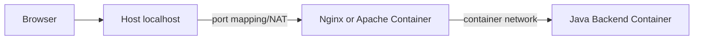

# 05-network-observation

## 概要
通信を分解して観測する。
Dockerネットワークを使い、リクエストがどこをどう通っているかを可視化する。

## 何を学べるのか
- localhost の正体
- Docker NAT / コンテナ間通信
- 「つながらない」時の切り分け方

## 使用技術
- Docker
- Nginx / Apache
- Java（03で作成したバックエンド）
- 観測コマンド（`curl`, `docker inspect`, `ss`, `tcpdump` など）

## 前提
- 03と04で作った構成を利用する
- ここでは新しいアプリ機能は作らず、通信経路の理解に集中する

## 構成図（Mermaid）

## なぜこの構成なのか
01-04で作った構成は「動く」状態になっている。  
05では、動作理由と故障理由を説明できる状態まで持っていくため。

## リクエストの流れ
1. `localhost:PORT`へ到達
2. Dockerのポート公開でコンテナへNAT
3. 前段サーバーからバックエンドへコンテナ間通信
4. 応答が逆順で返る

## 触るポイント
- `curl -v` でリクエスト/レスポンスヘッダー確認
- `docker inspect <container>` でIPとネットワーク確認
- `docker network inspect <network>` で接続関係確認
- `ss -lntp` で待ち受けポート確認
- 必要に応じて`tcpdump`でパケット観測

## よくある失敗
- ポート公開はあるが、コンテナ内サービスがそのポートで待っていない
- 同一Dockerネットワークに参加しておらず名前解決できない
- プロキシ先ホスト名がComposeサービス名と不一致
- 途中キャッシュで「直った/壊れた」を誤認する

## 実務との対応
- 障害一次切り分け（DNS/Port/Appのどこで詰まっているか）
- 「つながらない」の再現と証拠取得
- ECS/Kubernetesでも通用する観測思考の土台

## 次にやるなら
- 監視ログを追加し、アクセスログとアプリログの突合手順を定型化する
