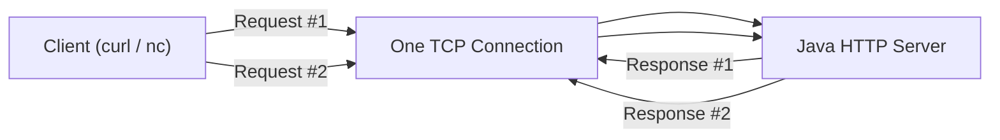

# 06-java-http-keep-alive

## 概要
`06` 配下で新しく実装したJava HTTPサーバーで、  
HTTP/1.1のkeep-alive（接続再利用）を学ぶ。

## 何を学べるのか
- `1接続 = 1リクエスト` から `1接続 = 複数リクエスト` への設計変更
- `Connection: close` とサーバー側ポリシー（timeout/最大件数）の役割
- HTTPメッセージ境界（`Content-Length`）を意識した読み取り
- 接続保持とリソース消費のトレードオフ

## 使用技術
- Java（`ServerSocket`, `Socket`）
- `curl` / `nc`（同一接続での連続リクエスト確認）

## 前提
- `03-java-only-http-server` の最小サーバーを理解していること（実装は06で新規作成）
- ここではHTTP/1.1の基本動作を対象とし、HTTP/2は扱わない

## 構成図（Mermaid）

## なぜこの構成なのか
プロキシやコンテナを挟まず、最小構成で「接続を使い回す意味」と  
「どの条件で切断すべきか」をサーバー実装レベルで理解するため。

## 学習ステップ（06）

### 6-1. 1接続1リクエスト実装を読み直す
やること:
- 現在の接続処理フロー（accept -> read -> write -> close）を確認
- どこで必ず切断しているかを明確化する

目的:
- keep-alive対応で変えるべき箇所を明確にする

### 6-2. 同一ソケット内でリクエスト読み取りループを作る
やること:
- 接続ごとの処理をループ化する
- 1レスポンス後に即closeせず、次のリクエストを待つ

目的:
- 接続再利用の基本構造を作る

### 6-3. 接続終了条件を実装する
やること:
- `Connection: close` を受けたら切断
- アイドルタイムアウトを設定して無通信接続を解放
- 接続あたりの最大リクエスト数を設定して上限管理

目的:
- 便利さと安全性の両立（保持しすぎ防止）

### 6-4. 動作を検証する
やること:
- `curl` で連続リクエストを送って再利用を確認
- `nc` で同一接続上に複数リクエストを手入力して確認
- `Connection: close` 指定時に切断されることを確認

目的:
- keep-aliveが実際に効いていることを観測で説明できるようにする

## 触るポイント
- `Socket#setSoTimeout(...)` によるアイドル管理
- `Connection` ヘッダーの解釈とレスポンス反映
- ループ終了時の確実なクローズ（例外時含む）

## よくある失敗
- リクエスト終端判定が曖昧で、次リクエスト読み取りに失敗する
- `Content-Length` 分を消費せず、ストリーム境界がずれる
- タイムアウト未設定でアイドル接続が残り続ける
- 例外時にソケットが閉じられずリークする

## 実務との対応
- keep-aliveによるレイテンシ改善と接続効率の理解
- 接続上限・タイムアウト設計の重要性理解
- 監視時に「なぜ接続が切れたか」を説明できる基礎

