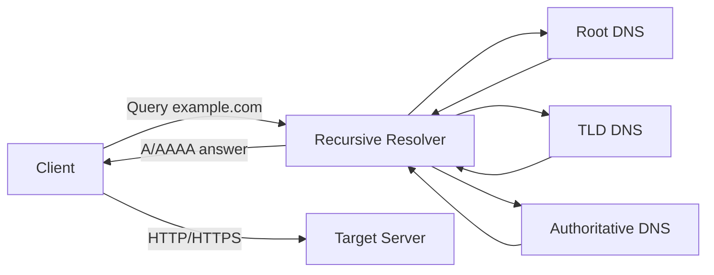

# 07-dns-name-resolution

## 概要
`07` では、DNSの名前解決フローを観測し、  
「ドメイン名がIPアドレスに変換されるまで」を説明できる状態を目指す。

## 何を学べるのか
- DNS問い合わせの基本フロー（キャッシュ -> 再帰解決）
- `A` / `AAAA` / `CNAME` など主要レコードの役割
- TTLとキャッシュによる挙動差
- HTTP/HTTPS到達前に起きている名前解決の実体

## 使用技術
- `dig` / `nslookup`
- `curl -v`（名前解決結果の確認）

## 前提
- `01`〜`06` の内容で、HTTP通信の基本を把握していること
- ここではDNSの基礎観測に絞り、権威DNS運用や高度なDNS設計は扱わない

## 構成図（Mermaid）

## なぜこの構成なのか
HTTP/HTTPSの前段にあるDNSを先に観測することで、  
「つながらない時にどこで詰まっているか」を切り分けられるようにするため。

## 学習ステップ（07）

### 7-1. 基本レコードを確認する
やること:
- `dig` または `nslookup` で `A` / `AAAA` / `CNAME` を確認する
- 同一ドメインでレコードタイプごとの返り値差分を記録する

目的:
- レコード種類ごとの意味を、結果を見ながら説明できるようにする

### 7-2. TTLとキャッシュの挙動を確認する
やること:
- 複数回問い合わせてTTLの減少や応答差分を観測する
- 環境差（ローカル・リゾルバ）で挙動が変わる点を記録する

目的:
- 「毎回同じに見えない理由」をTTL/キャッシュで説明できるようにする

### 7-3. HTTP/HTTPSへの接続とつなげる
やること:
- `curl -v` で名前解決結果と接続先IPを確認する
- DNS解決が失敗した場合のエラーメッセージを1つ確認する

目的:
- DNSとHTTP/HTTPSを分離してトラブルシュートできるようにする

## 触るポイント
- `dig +short` と通常出力の使い分け
- `CNAME` 先の再解決
- `curl -v` の `Trying ...` 行で接続先IPを確認する癖

## よくある失敗
- DNS未解決をHTTPの問題だと誤認する
- `CNAME` と最終 `A/AAAA` の関係を見落とす
- TTLを見ずに「結果が変わった/変わらない」を誤解する

## 実務との対応
- 障害一次切り分け（DNS問題か、アプリ/ネットワーク問題か）
- CDNやLB配下の名前解決の理解
- 証明書/HTTPS確認時の前提としての名前解決チェック
