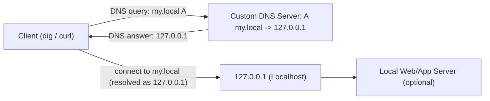

# QA_MEMO_DNS_SERVER

このメモは、`08-build-dns-server` の作業中に出た疑問を整理したもの。  
各項目は「疑問点」と「こういう意味らしい」で記録する。

## 1. 自作DNSサーバーの基本


## Q1. UDP `:5353` でDNSクエリを受信する、とは？

疑問点:
- 「UDP `:5353` でDNSクエリとは何を指している？」

回答:
- 自作DNSサーバーがUDPの `5353` 番ポートで待ち受ける、という意味。
- `dig @127.0.0.1 -p 5353 my.local A` のような要求が、そのポートに届く。
- その要求パケットに、問い合わせ名（`my.local`）や種別（`A`）が入っている。
- 補足: 環境によっては `5353` がmDNS用途で使われるため、必要なら `10053` などへ変更する。

## Q2. なぜ「クエリ」という表現を使う？

疑問点:
- 「なぜクエリという表現をする？DBクエリと何が違う？」

回答:
- DNS仕様で `query`（問い合わせ）/`response`（応答）という用語を使うため。
- 共通点: どちらも「要求を送って結果を受ける」。
- 違い:
  - DBクエリはSQLなどで検索/更新のような操作を行う。
  - DNSクエリは名前解決専用で、要求形式が決まったプロトコルメッセージ。

## Q3. 問い合わせ名に対する `127.0.0.1` はどこで設定する？

疑問点:
- 「問い合わせ名に対して`127.0.0.1`はどこで保存して設定できるの？」

回答:
- 最小実装ではJavaコード内に固定値として埋め込んでいる（ハードコード）。
- DNS回答のRDATAに `127.0.0.1` を4バイトで書いて返している。
- 拡張時は `Map<String, String>`（例: `my.local -> 127.0.0.1`）で名前とIPの対応を保持すると管理しやすい。

## Q4. そもそもなぜUDPなの？

疑問点:
- 「DNSはなぜUDPを使うの？」

回答:
- DNSの多くは小さい要求/応答で、接続確立不要のUDPが高速で軽量だから。
- 1往復で完結しやすく、遅延を抑えやすい。
- ただし、応答が大きい場合や切り詰め（TC）時、ゾーン転送ではTCPを使う。
- つまり実運用は「通常UDP、必要時TCP」の使い分け。

## Q5. UDPについて詳しく

疑問点:
- 「UDPについても詳しく知りたい」

回答:
- UDP（User Datagram Protocol）は、接続を張らずにデータグラムを送る軽量プロトコル。
- TCPとの主な違い:
  - UDPは接続確立なし（高速・軽量）
  - 到達保証なし
  - 順序保証なし
  - 再送制御なし
- 送信側は「投げるだけ」で、届く保証はアプリ側で設計する必要がある。
- 向いている用途:
  - DNS（通常問い合わせ）
  - 音声通話（VoIP）
  - ゲーム通信
  - DHCP / NTP など
- DNSでUDPが使われる理由:
  - 問い合わせ/応答が小さいことが多く、1往復で完了しやすい
  - 接続確立が不要で遅延が小さい
- 例外的にTCPを使うケース:
  - 応答サイズが大きい
  - TC（truncated）で切り詰め発生
  - ゾーン転送（AXFR/IXFR）

## Q6. DHCPって何？

疑問点:
- 「DHCPって何」

回答:
- DHCPは、端末へIP設定を自動配布する仕組み（Dynamic Host Configuration Protocol）。
- 自動配布される主な情報:
  - IPアドレス
  - サブネットマスク
  - デフォルトゲートウェイ
  - DNSサーバー情報
  - リース時間（有効期限）
- 動作イメージ:
  - 端末がネットワーク参加時に設定を要求
  - DHCPサーバーが利用可能な設定を返す
  - 端末はその設定で通信可能になる

## Q7. DatagramSocketって何？

疑問点:
- 「DatagramSocketって何」

回答:
- JavaでUDP通信を行うためのソケットクラス。
- TCPの `Socket` と違い、接続を張らずにデータグラム（パケット）単位で送受信する。
- 主に `receive()` で受信し、`send()` で送信する。
- DNSの最小実装では、通常問い合わせがUDP中心なので使う。

## Q8. buildResponse関数の内部実装はそれぞれ何をしている？

疑問点:
- 「buildResponse関数の内部実装はそれぞれ何をしている？」

回答:
- 受信クエリの最小妥当性チェック（ヘッダ12バイト未満を除外）。
- `QDCOUNT` を読み取り、質問1件以外を未対応として除外。
- QNAME終端まで走査し、`QTYPE` / `QCLASS` を取り出す。
- `A`（`QTYPE=1`）かつ `IN`（`QCLASS=1`）だけ処理対象にする。
- クエリを土台に応答バイト列を作り、応答フラグと `ANCOUNT=1` を設定。
- 回答部を追記し、固定 `A 127.0.0.1`（TTL 60秒）を返す。
- 条件を満たさないクエリは `null` を返す（未対応扱い）。

## Q9. この受信処理は何をしている？socketとpacketの違いは？

疑問点:
- "`byte[] buf = new byte[512];`
  `DatagramPacket packet = new DatagramPacket(buf, buf.length);`
  `socket.receive(packet);`
  ここの処理は何をしている？"
- 「socketとpacketの違いは何？」

回答:
- 処理内容:
  - `buf`: 受信データを書き込むバイト配列を用意する。
  - `packet`: `buf` を使う受信用コンテナを作る（データ本体 + 送信元情報）。
  - `socket.receive(packet)`: UDPで1パケット受信し、`packet` にデータと送信元IP/ポートを詰める。
- 違い:
  - `socket`: 通信の窓口（ポートで待受し、送受信する主体）。
  - `packet`: 1回分のメッセージを運ぶ器（中身と宛先/送信元情報）。

## Q10. `dig @127.0.0.1 -p 10053 my.local A` 実行時の警告の意味

実行コマンド:
```bash
dig @127.0.0.1 -p 10053 my.local A
```

実行ログ:
```text
;; Warning: Message parser reports malformed message packet.

; <<>> DiG 9.10.6 <<>> @127.0.0.1 -p 10053 my.local A
; (1 server found)
;; global options: +cmd
;; Got answer:
;; WARNING: .local is reserved for Multicast DNS
;; You are currently testing what happens when an mDNS query is leaked to DNS
;; ->>HEADER<<- opcode: QUERY, status: NOERROR, id: 56260
;; flags: qr rd ra; QUERY: 1, ANSWER: 1, AUTHORITY: 0, ADDITIONAL: 1

;; OPT PSEUDOSECTION:
; EDNS: version: 0, flags:; udp: 4096
;; QUESTION SECTION:
;my.local.                      IN      A

;; ADDITIONAL SECTION:
my.local.               60      IN      A       127.0.0.1

;; Query time: 31 msec
;; SERVER: 127.0.0.1#10053(127.0.0.1)
;; WHEN: Mon Mar 30 23:38:29 JST 2026
;; MSG SIZE  rcvd: 53
```

解説:
- `SERVER: 127.0.0.1#10053` が出ているので、自作DNSサーバーには到達して応答できている。
- `A 127.0.0.1` も返っているため、最小ゴール（固定A応答）は概ね達成。
- ただし `malformed message packet` は、DNS応答パケットの構造が完全には正しくないことを示す。
- この実装ではクエリ全体（EDNSの追加レコードを含む）をそのままコピーした後に回答を足しているため、セクション整合が崩れやすい。
- その結果、本来 `ANSWER SECTION` に出るべき `A` レコードが `ADDITIONAL SECTION` 側に見えている。
- `.local` 警告は、`local` がmDNS予約名であるための注意喚起。学習用途では無視してよいが、混乱回避のため `my.test` など別名を使うと見通しがよい。

次に直すポイント:
- 応答生成時に、質問部の末尾までを正しくコピーして回答を追加する。
- ヘッダの `ANCOUNT` / `ARCOUNT` を実際のセクション構成と一致させる。
- 学習中は `my.local` ではなく `my.test` を使ってmDNS警告を避ける。

## Q11. この自作DNSサーバーは役割として何になる？

疑問点:
- 「https://qiita.com/hypermkt/items/610b5042d290348a9dfa の整理で、今回のDNSサーバーは何になるの？」

回答:
- 今回の自作DNSは、権威DNSサーバー寄り（超ミニ版）。
- 理由:
  - 再帰問い合わせをしていない。
  - 自分が持つ固定回答（`A 127.0.0.1`）を直接返している。
- キャッシュDNS（再帰リゾルバ）ではない。
- ただし委任・ゾーン管理など未実装なので、厳密には「権威DNSサーバーもどき」。

## Q12. `127.0.0.1` をAとしているのはどういうこと？

疑問点:
- 「127.0.0.1をAとしているのはどういうこと？」

回答:
- `A` レコードは「名前に対応するIPv4アドレス」を返すレコード。
- `my.local` への `A` 問い合わせに `127.0.0.1` を返す、という意味。
- つまり今の対応は `my.local -> 127.0.0.1`。
- 解決後に `my.local` へ接続すると、実際には自分のPC（localhost）へ接続される。

## Q13. Mermaid構成図

疑問点:
- 「Mermaidで構成図を表したい」

回答:

