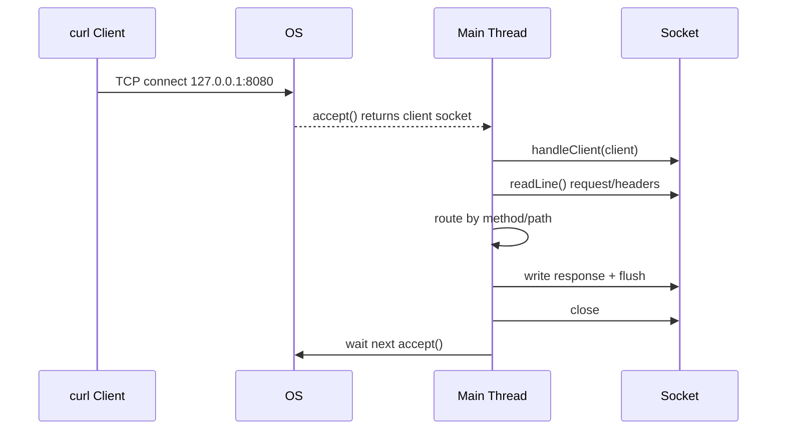

# QA_MEMO_API_SERVER

このメモは、`10-build-api-server` の作業中に出た疑問を整理したもの。  
各項目は「疑問点」と「回答」で記録する。

## Q1. ソケットで「ポートをバインドする」とは？

疑問点:
- 「ソケットサーバー通信をしたときに、ソケットにポートをバインドするとはどういう意味？」

回答:
- 「このポート番号をこのプロセスが使う」とOSに登録すること。
- `new ServerSocket(8080)` を実行すると、`127.0.0.1:8080` 宛の接続をそのサーバーが受け取れる状態になる。
- 同じIP/ポートを別プロセスが同時に使うと競合し、起動時にエラーになる。

## Q2. `curl` で叩いてからAPIが呼ばれるまでの流れは？

疑問点:
- 「`curl` で叩いてから、どのような流れでAPIが呼び出されるの？」

回答:
- `curl` が `127.0.0.1:8080` にTCP接続を開始する。
- OSが接続を受け取り、待受中の `ServerSocket` に渡す。
- `server.accept()` が接続を1件取り出し、`Socket client` を返す。
- `handleClient(client)` でリクエスト行とヘッダーを読み取る。
- `method/path` で分岐して、ステータスとJSON本文を決める。
- `OutputStream` にHTTPレスポンスを書き、`flush()` で送信する。
- 接続を閉じて次の `accept()` 待ちに戻る。

シーケンス図:

## Q3. `private static final int PORT = 8080;` の `final` は何のため？

疑問点:
- 「`private static final int port = 8080;` ここに`final`をつける意味は？」

回答:
- `final` は再代入を禁止し、値を固定するために使う。
- ポート番号を定数として扱えるので、意図しない変更を防げる。
- 「この値は変えない前提」という設計意図をコードで明示できる。

## Q4. 今回の実装はController層だけで完結？

疑問点:
- 「Controller層だけで完結する作り？」

回答:
- 現時点の最小実装は、受信・ルーティング・レスポンスを1ファイルにまとめた構成。
- そのため厳密な層分離はまだしていない。
- 次段階でController / Service / Repositoryに分ける前提。

## Q5. DB接続まで入れるならどう分ける？

疑問点:
- 「DBへの接続までを作る場合はController / Service / Repositoryを作成する感じ？」

回答:
- その分割で進めるのが基本。
- Controller: HTTP入出力
- Service: 業務ロジック
- Repository: DBアクセス（INSERT/SELECTなど）

## Q6. API実装と認証実装はどちらを先にやる？

疑問点:
- 「自作認証サーバーとAPI作成はどちらを先にやるべき？」

回答:
- 先にAPI最小実装を作る方が進めやすい。
- 先にHTTPの土台（ルーティング、レスポンス、エラー処理）を固めると、認証の不具合切り分けがしやすい。
- 推奨順は `API最小実装 -> DB接続 -> 認証追加`。

## Q7. これまで作っていたHTTPサーバーもAPIサーバー？

疑問点:
- 「これまで作ってたHTTPサーバーとかもAPIサーバー？」

回答:
- 広い意味ではAPIサーバーに含まれる。
- エンドポイント（例: `/hello`）にHTTPで応答しているため。
- 違いは機能の範囲で、今回は最小実装から実用寄りへ段階的に拡張する。
