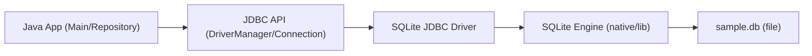
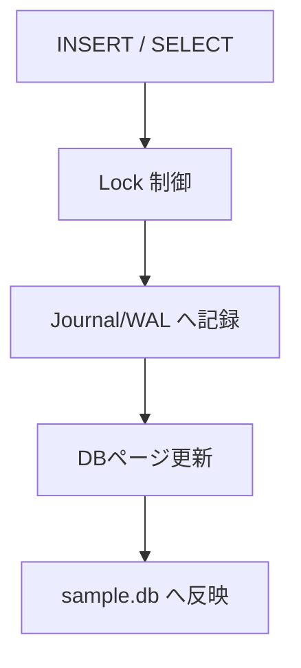

# QA_MEMO_DB_CONNECTION

このメモは、`11-build-db-connection` の作業中に出た疑問を整理したもの。  
各項目は「疑問点」と「回答」で記録する。

## Q1. `javac` と `java` の両方で JDBC ドライバを含めるのはなぜ？

疑問点:
- 「`javac -cp ...` と `java -cp ...` の両方に `sqlite-jdbc.jar` を入れるのはなぜ？」

回答:
- `javac` 時は、JDBC関連クラス参照を解決してコンパイルするために必要。
- `java` 実行時は、`DriverManager` が実際のSQLiteドライバ実装を見つけて接続するために必要。
- 実行時のクラスパスから外すと、`No suitable driver` などで失敗する。

## Q2. 実装順は `Main -> Controller` からではないの？

疑問点:
- 「実行フローは `Main -> Controller` なのに、なぜその順で実装しないことがあるの？」

回答:
- 実行フローと実装順は一致しなくてもよい。
- 依存関係が下層へ向くため、実装は `Repository -> Service -> Controller -> Main` の順にすると未定義エラーを減らしやすい。
- 実行時の呼び出し順は最終的に `Main -> Controller -> Service -> Repository` で問題ない。

## Q3. `Database.java` は何をしている？

疑問点:
- 「`Database` ファイルの中では何をしているのか？」

回答:
- 接続先URL（`jdbc:sqlite:sample.db`）を1か所で管理している。
- `getConnection()` で `Connection` を返し、Repositoryから再利用できるようにしている。
- 目的は、接続生成処理の重複を避けて責務を分離すること。

## Q4. `Connection` の説明文全体は何を表現している？

疑問点:
- 「`Connection` に関する説明文は全体として何を言っているのか？」

回答:
- `Connection` は「特定DBとの接続（セッション）」を表す。
- この接続コンテキスト内でSQLを実行し、結果を受け取る。
- `getMetaData()` により、テーブル情報・対応機能・接続能力などDB自身の情報を参照できる。
- つまり、`Connection` は「SQL実行の入口」と「DB情報取得の窓口」を兼ねる。

## Q5. ストアドプロシージャとは？

疑問点:
- 「ストアドプロシージャとは何か？」

回答:
- DB側に保存して呼び出せる、SQL処理の手続き（命令のまとまり）。
- アプリ側は処理の詳細を毎回送らず、プロシージャ名を呼ぶ形で実行できる。
- 複数SQLを1つの処理として扱えるため、共通処理の再利用に向く。
- 補足: SQLiteは一般的な意味でのストアドプロシージャを標準サポートしていない。

## Q6. DriverManager は何？

疑問点:
- 「DriverManagerはなんだっけ？」

回答:
- JDBCで、接続URLに合うドライバを見つけて `Connection` を返す窓口クラス。
- `DriverManager.getConnection("jdbc:sqlite:sample.db")` でSQLite接続を作る。

## Q7. `jdbc:sqlite:sample.db` はどこにある？

疑問点:
- 「これはすでに存在する？どこにある？ローカルにある？」

回答:
- 既存とは限らず、初回接続時に作成されることがある。
- `sample.db` は相対パスなので、実行ディレクトリ直下に作成される。
- 今回は通常 `/Users/ktoyo/Documents/Web-under-the-hood/11-build-db-connection/sample.db`。

## Q8. model処理の良い点・悪い点は？

疑問点:
- 「`User` モデルの良い点と悪い点は？」

回答:
- 良い点: 不変で安全、構造が小さく読みやすい、層間データ受け渡しに使いやすい。
- 悪い点: モデル自身の妥当性保証が薄い、`equals/hashCode/toString` がない、拡張時に肥大化しやすい。

## Q9. PreparedStatement は何？

疑問点:
- 「PreparedStatementはなに？」

回答:
- `?` プレースホルダに値を安全にバインドして実行するSQLオブジェクト。
- 文字列連結よりSQLインジェクションに強く、同じSQLを再利用しやすい。

## Q10. `insert` 処理は1行ずつ何をしている？

疑問点:
- 「今回の場合は1行ずつ何をしているの？」

回答:
- `String sql = "INSERT INTO users(name) VALUES(?)";`
  - `name` を1つ受け取る `INSERT` 文を定義。
- `try (Connection conn = Database.getConnection();`
  - DB接続を取得。`try-with-resources` で自動クローズ対象にする。
- `PreparedStatement stmt = conn.prepareStatement(sql)) {`
  - SQLを `PreparedStatement` として準備。接続と同様に自動クローズ。
- `stmt.setString(1, name);`
  - 1番目の `?` に `name` を代入。
- `stmt.executeUpdate();`
  - `INSERT` を実行し、更新件数を反映。
- `}`
  - ブロックを抜けると `stmt` と `conn` が自動で閉じる。

## Q11. PreparedStatement の内部的な仕組みは？

疑問点:
- 「`PreparedStatement` の内部はどうなっているの？」

回答:
- アプリはまずSQLテンプレート（`INSERT ... VALUES(?)`）をドライバへ渡して準備する。
- その後 `setString(1, name)` などで、SQL文字列に連結せず「パラメータ値」として別枠で渡す。
- 実行時にドライバがテンプレートとパラメータを組み合わせてDBへ送る。
- 値は「SQLの一部」ではなく「データ」として扱われるため、SQLインジェクション耐性が上がる。
- 同じテンプレートを再利用する場合、毎回SQL文字列を作り直すより効率がよい。
- SQLiteのような組み込みDBでは最適化効果は限定的なこともあるが、安全性と可読性のメリットが大きい。

## Q12. `import db.Database;` で「パッケージdbは存在しません」になる理由は？

疑問点:
- 「`src/repository/UserRepository.java:3: パッケージdbは存在しません` になるのはなぜ？」

回答:
- `Database.java` は `src/db/Database.java` にあり、`package db;` で正しい。
- そのため主因は、`UserRepository.java` 単体をコンパイルしていて `src` がクラスパス/ソースパスに入っていないこと。
- `11-build-db-connection` 直下で、次のように全体をコンパイルすると解消できる:
  - `javac -cp "lib/sqlite-jdbc.jar:src" $(find src -name "*.java")`
- 補足: 上記エラー解消後、現在のコードでは `uses.add(...)` のタイプミス（`users.add(...)` が正）で次のエラーが出る。

## Q13. `initializeTable` / `insert` 以外の実装は何をしている？

疑問点:
- 「この箇所以外の実装（他メソッド）は何をしているの？」

回答:
- `UserRepository.findAll()`
  - `SELECT id, name FROM users ORDER BY id` を実行し、`ResultSet` を1行ずつ `User` に変換して `List<User>` で返す。
  - 注意: 現在コードに `uses.add(...)` のタイプミスがある場合は `users.add(...)` に修正が必要。
- `UserService.initialize()`
  - Repositoryの `initializeTable()` を呼び、起動時にテーブルを作成/存在確認する。
- `UserService.registerUser(name)`
  - `null` や空白のみを弾く入力チェックを行い、問題なければ Repositoryへ保存を依頼する。
- `UserService.getAllUsers()`
  - Repositoryの `findAll()` をそのまま呼んで一覧取得する。
- `UserController.runDemo()`
  - 初期化、サンプル登録（Alice/Bob）、一覧表示というデモの実行順を制御する。
- `Main.main()`
  - `Repository -> Service -> Controller` を組み立てて起動するエントリポイント。
  - 例外時は標準エラーへ原因を出力する。

## Q14. 最初の `initialize()` は何をしている？

疑問点:
- 「最初の `initialize` は何をしているの？」

回答:
- `UserService.initialize()` が `UserRepository.initializeTable()` を呼び、`users` テーブルを作成/存在確認している。
- 実体は `CREATE TABLE IF NOT EXISTS users (...)` の実行で、テーブルがなければ作成、あれば何もしない。
- 目的は、後続の `insert` や `select` が失敗しないように、起動時にDBの土台を整えること。

## Q15. 実行後、テーブルとデータはどこに作成される？

疑問点:
- 「実装を実行すると、テーブル情報とデータはどこに作成されるの？」

回答:
- 今回の接続URLは `jdbc:sqlite:sample.db` なので、SQLiteのDBファイル `sample.db` に保存される。
- `sample.db` は相対パス指定のため、`java` コマンドを実行したカレントディレクトリ直下に作成される。
- 手順どおり `11-build-db-connection` で実行した場合の保存先は:
  - `/Users/ktoyo/Documents/Web-under-the-hood/11-build-db-connection/sample.db`
- テーブル定義もレコードも、この1つの `.db` ファイル内に格納される。

## Q16. `No suitable driver found for jdbc:sqlite:sample.db` の原因は？

疑問点:
- 「`No suitable driver found for jdbc:sqlite:sample.db` が出るのはなぜ？」

回答:
- 直接原因は、JDBCドライバが初期化できず `DriverManager` に登録されていないこと。
- 今回は `sqlite-jdbc.jar` は存在したが、依存の `slf4j` が不足して `org.sqlite.JDBC` 初期化時に失敗していた。
- 対応:
  - `lib/sqlite-jdbc.jar`
  - `lib/slf4j-api.jar`
  - `lib/slf4j-nop.jar`
  を揃え、`-cp "lib/*:src"` で実行する。

## Q17. `No suitable driver` って何？

疑問点:
- 「`No suitable driver` って何？」

回答:
- `DriverManager` が、指定した接続URL（例: `jdbc:sqlite:sample.db`）を扱えるJDBCドライバを見つけられないときのエラー。
- 主な原因は次のどれか:
  - ドライバjarがクラスパスにない
  - URL書式がドライバと合っていない
  - ドライバ初期化が依存不足などで失敗している

## Q18. SLF4J の特性は？

疑問点:
- 「SLF4Jの特性について知りたい」

回答:
- SLF4Jはログの「共通インターフェース（Facade）」であり、実際の出力実装そのものではない。
- そのため通常は2つが必要:
  - `slf4j-api`（呼び出し口）
  - 実装バインディング（例: `slf4j-nop`, `logback-classic`）
- 利点:
  - アプリコードを変えずにログ実装を差し替えやすい
  - ライブラリ間でログAPIを統一しやすい
- 今回の `slf4j-nop` は「ログを捨てる最小実装」で、学習用に依存解決だけしたいときに使いやすい。

## Q19. Qiita記事（SLF4J / Logback / Log4J）の要約

対象記事:
- https://qiita.com/NagaokaKenichi/items/9febd2e559331152fcf8

要約:
- SLF4Jはロギング実装そのものではなく、Facade（共通窓口）として機能する。
- Logback や Log4J は実際のロギング実装で、SLF4J経由で切り替えて使える。
- アプリ側コードは `LoggerFactory` / `Logger` を使うだけにしておけば、依存設定の変更だけで実装を差し替えやすい。
- Log4J利用時は `slf4j-log4j12` のようなバインディング（アダプタ）が間に入り、SLF4J呼び出しをLog4J実装に橋渡しする。
- 記事の主張は「ログ実装の柔軟な切り替え」を設計面のメリットとして理解すること。

今回の学習への接続:
- `sqlite-jdbc` がSLF4J APIを参照するため、`slf4j-api` と実装（今回は `slf4j-nop`）が必要だった理由と整合する。
- つまり「SLF4Jは窓口、実装は別途必要」という点が、今回の `No suitable driver` 背景理解に直結する。

注意:
- 記事の投稿日・更新日は 2018-12-06 で、依存バージョン例は当時の情報。
- 実務では2026年時点の最新互換バージョンとセキュリティ情報を合わせて確認する。

## Q20. まだ `No suitable driver` が出るときの確認ポイントは？

疑問点:
- 「依存を入れたはずなのに、まだ `No suitable driver` が出る」

回答:
- まず `11-build-db-connection` 直下で実行しているか確認する（相対パス `lib/*` 前提）。
- 実行コマンドは次を使う:
  - `javac -cp "lib/*:src" $(find src -name "*.java")`
  - `java -cp "lib/*:src" Main`
- `lib` に次の3つがあるか確認する:
  - `sqlite-jdbc.jar`
  - `slf4j-api.jar`
  - `slf4j-nop.jar`
- `java -cp "lib/sqlite-jdbc.jar:src" Main` のように `sqlite-jdbc` だけ指定すると、依存不足で同エラーになることがある。

## Q21. `Alice/Bob` が毎回増えるのはなぜ？

疑問点:
- 「実行するたびに `1: Alice, 2: Bob, 3: Alice...` と増えるのはなぜ？」

回答:
- `runDemo()` が毎回 `registerUser("Alice")` と `registerUser("Bob")` を実行しているため。
- `initializeTable()` はテーブル作成/存在確認だけで、既存データは削除しない。
- そのため同じ `sample.db` を使って再実行すると、レコードが累積して表示件数が増える。
- リセットしたい場合は `sample.db` を削除するか、起動時に明示的な削除SQL（`DELETE FROM users`）を入れる。

## Q22. `sample.db` の中身を確認するには？

疑問点:
- 「`sample.db` のテーブルやデータを確認したい」

回答:
- 対話モード:
  - `cd /Users/ktoyo/Documents/Web-under-the-hood/11-build-db-connection`
  - `sqlite3 sample.db`
  - `.tables`
  - `.schema users`
  - `SELECT * FROM users;`
  - `.quit`
- 1行コマンド:
  - `sqlite3 sample.db "SELECT * FROM users;"`

## Q23. `sqlite3 sample.db` でなぜDBに入れるの？

疑問点:
- 「`sqlite3 sample.db` で、なぜDBの中に入れるの？」

回答:
- `sqlite3` は SQLite 専用のCLIクライアントで、`sample.db` というDBファイルを直接開く。
- SQLiteはサーバー型DB（MySQL/PostgreSQL）と違い、DB本体が1つのファイルに入っている。
- そのため、CLIがファイルを読み書きし、SQL実行やテーブル確認をその場で行える。

構成イメージ:

今回の実装との対応:
- アプリ実行時:
  - Javaアプリ -> JDBCドライバ -> `sample.db`
- 手動確認時:
  - `sqlite3` CLI -> `sample.db`
- どちらも同じ `sample.db` を見ているため、アプリで保存したデータをCLIで確認できる。

## Q24. 通信まわりと SQLite ファイル内部の動きは？

疑問点:
- 「通信まわりの話と、SQLite上でファイルがどう動くかを知りたい」

回答:
- SQLiteはサーバーDBと違い、TCPでDBサーバーへ通信しない。
- 代わりに同一マシン内で、プロセスがSQLiteライブラリを通じてDBファイルを直接読み書きする。
- ただし「プロセス内の呼び出し」は層として見ると通信に近い流れ（API呼び出し連鎖）になっている。

通信（呼び出し連鎖）の構成図:

ポイント:
- `DriverManager.getConnection("jdbc:sqlite:sample.db")` でドライバに処理が渡る。
- ドライバがSQLiteエンジンを呼び出し、SQLを実行して結果を返す。
- ここにDBサーバーとのネットワーク往復はない（ローカルI/O中心）。

SQLiteファイル更新の構成図（概念）:

ポイント:
- 更新系（INSERT/UPDATE/DELETE）では、整合性のためにロックとジャーナル/WALを使う。
- 障害時はジャーナル/WALを使って整合性を回復する。
- 読み取り系（SELECT）は主にDBページを読み出し、必要に応じてキャッシュを利用する。

補足（サーバーDBとの違い）:
- MySQL/PostgreSQL: `App -> TCP -> DB Server -> Data File`
- SQLite: `App -> SQLite Library -> Data File`

## Q25. journal / WAL って何？

疑問点:
- 「journal / WAL って何？」

回答:
- どちらもSQLiteの整合性を守るための記録方式。
- `journal`（ロールバックジャーナル）:
  - 更新前データを一時ファイルへ退避してから本体を更新する。
  - 途中で失敗した場合、退避情報を使って元に戻せる。
- `WAL`（Write-Ahead Logging）:
  - 変更を先に `-wal` ファイルへ追記し、後で本体DBへ反映する。
  - 読み取りと書き込みの並行性が上がりやすい。
- 共通の目的は「異常終了時でもDB整合性を保つこと」。
