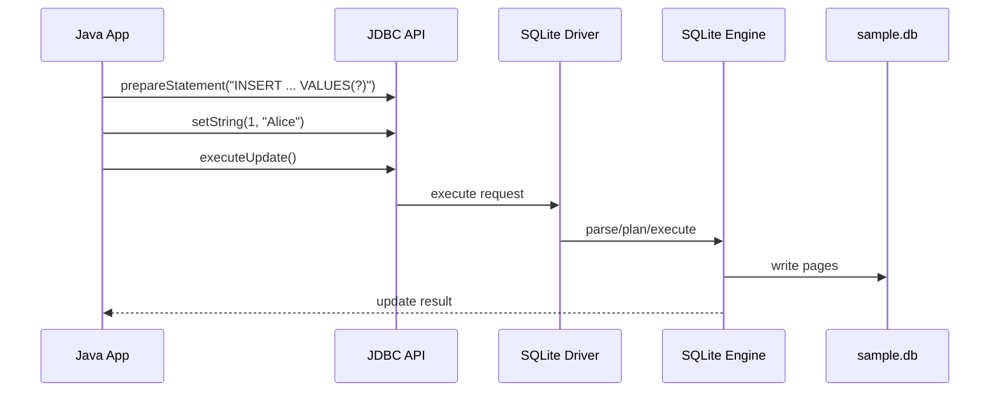
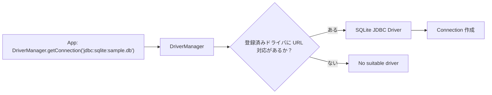
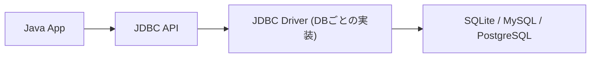

# フレームワークなしで理解する Java + SQLite のDB接続入門

## はじめに

今回は、Java（JDBC）から SQLite に接続し、`INSERT` / `SELECT` が通る最小構成を作りながら、  
「DB接続の流れ」と「接続の裏側で何が起きているか」を確認します。

この記事の目的:

- DB接続までの実装ステップを整理する
- `DriverManager` / `Connection` / `PreparedStatement` の役割を理解する

こんな人向け:

- Javaで「DB接続までの流れ」をまず一通り掴みたい
- フレームワークなしで JDBC の基本を理解したい

---

## 前提環境

- Java 17
- SQLite JDBC: `org.xerial:sqlite-jdbc:3.51.2.0`
- （任意）SLF4J: `slf4j-api`, `slf4j-nop`
  - 例: `sqlite-jdbc 3.46.0.0` では必要になるケースあり（`3.51.2.0` では不要な構成あり）

ディレクトリ:

```text
project/
  src/
    Main.java
    db/Database.java
    model/User.java
    repository/UserRepository.java
    service/UserService.java
    controller/UserController.java
  lib/
    sqlite-jdbc.jar
  sample.db
```

---

## 全体像（構成図）


- `Controller -> Service -> Repository` で責務を分ける
- DB接続情報は `Database` に集約する

---

## 実装ステップ

### Step 1. DB接続の入口を作る（`src/db/Database.java`）

```java
package db;

import java.sql.Connection;
import java.sql.Driver;
import java.sql.SQLException;
import java.util.Properties;

public class Database {
    private static final String URL = "jdbc:sqlite:sample.db";

    public static Connection getConnection() throws SQLException {
        Driver driver = new org.sqlite.JDBC();
        Connection connection = driver.connect(URL, new Properties());

        if (connection == null) {
            throw new SQLException("Failed to create SQLite connection for URL: " + URL);
        }
        return connection;
    }
}
```

ポイント:

- `jdbc:sqlite:sample.db` は「SQLiteファイルへの接続先」
- 相対パスなので、実行ディレクトリ配下に `sample.db` が作られる

### Step 2. モデルを作る（`src/model/User.java`）

```java
package model;

public class User {
    private final int id;
    private final String name;

    public User(int id, String name) {
        this.id = id;
        this.name = name;
    }

    public int getId() {
        return id;
    }

    public String getName() {
        return name;
    }
}

```

### Step 3. RepositoryでSQLを実装する（`src/repository/UserRepository.java`）

```java
package repository;

import db.Database;
import model.User;

import java.sql.Connection;
import java.sql.PreparedStatement;
import java.sql.ResultSet;
import java.sql.SQLException;
import java.util.ArrayList;
import java.util.List;

public class UserRepository {
    public void initializeTable() throws SQLException {
        String sql =
            "CREATE TABLE IF NOT EXISTS users (" +
            "id INTEGER PRIMARY KEY AUTOINCREMENT, " +
            "name TEXT NOT NULL" +
            ")";

        try (Connection conn = Database.getConnection();
             PreparedStatement stmt = conn.prepareStatement(sql)) {
            stmt.execute();
        }
    }

    public void insert(String name) throws SQLException {
        String sql = "INSERT INTO users(name) VALUES(?)";

        try (Connection conn = Database.getConnection();
             PreparedStatement stmt = conn.prepareStatement(sql)) {
            stmt.setString(1, name);
            stmt.executeUpdate();
        }
    }

    public List<User> findAll() throws SQLException {
        String sql = "SELECT id, name FROM users ORDER BY id";
        List<User> users = new ArrayList<>();

        try (Connection conn = Database.getConnection();
             PreparedStatement stmt = conn.prepareStatement(sql);
             ResultSet rs = stmt.executeQuery()) {
            while (rs.next()) {
                users.add(new User(rs.getInt("id"), rs.getString("name")));
            }
        }
        return users;
    }
}
```

Step 3 のポイント（この直後に押さえる）:

- `initializeTable()` で `users` テーブルを作成（なければ作る）
- `insert()` で `INSERT` 実行
- `findAll()` で `SELECT` 実行

特に `insert()` のこの部分が、DB接続の核心です。

```java
String sql = "INSERT INTO users(name) VALUES(?)";
PreparedStatement stmt = conn.prepareStatement(sql);
stmt.setString(1, name);
stmt.executeUpdate();
```

`prepareStatement` の役割は、`?` 付きSQLを実行前に準備し、あとから値を安全に差し込める状態にすることです。  
このメソッドが返す `PreparedStatement` に対して、`setString(1, name)` のように値をバインドし、最後に `executeUpdate()` で実行します。  
SQL文字列を連結しないため、可読性と安全性（SQLインジェクション耐性）が上がるのがポイントです。

公式APIリファレンス（Java SE 8 / PreparedStatement）:  
[Oracle Java 8 PreparedStatement API](https://docs.oracle.com/javase/jp/8/docs/api/java/sql/PreparedStatement.html)

`?` はプレースホルダで、SQL文字列連結ではなく値バインドを使います。  
そのため、`name` はSQL命令ではなくデータとして扱われます。


内部の流れ（Step 3 のSQLが実行される瞬間）:



更新時は整合性を守るために `journal` / `WAL` が使われます。

- `journal`（ロールバックジャーナル）: 更新前を退避して失敗時に戻せる
- `WAL`（Write-Ahead Logging）: 先に `-wal` へ追記して後で本体へ反映する

公式ドキュメント（SQLite WAL）:  
https://sqlite.org/wal.html

### Step 4. Serviceで業務ロジックを分ける（`src/service/UserService.java`）

```java
package service;

import model.User;
import repository.UserRepository;

import java.sql.SQLException;
import java.util.List;

public class UserService {
    private final UserRepository userRepository;

    public UserService(UserRepository userRepository) {
        this.userRepository = userRepository;
    }

    public void initialize() throws SQLException {
        userRepository.initializeTable();
    }

    public void registerUser(String name) throws SQLException {
        if (name == null || name.trim().isEmpty()) {
            throw new IllegalArgumentException("name is required");
        }
        userRepository.insert(name.trim());
    }

    public List<User> getAllUsers() throws SQLException {
        return userRepository.findAll();
    }
}
```

### Step 5. Controllerで実行の流れを作る（`src/controller/UserController.java`）

```java
package controller;

import model.User;
import service.UserService;

import java.sql.SQLException;
import java.util.List;

public class UserController {
    private final UserService userService;

    public UserController(UserService userService) {
        this.userService = userService;
    }

    public void runDemo() throws SQLException {
        userService.initialize();
        userService.registerUser("Alice");
        userService.registerUser("Bob");

        List<User> users = userService.getAllUsers();
        for (User user : users) {
            System.out.println(user.getId() + ": " + user.getName());
        }
    }
}
```

### Step 6. Mainで依存を組み立てて起動する（`src/Main.java`）

```java
import controller.UserController;
import repository.UserRepository;
import service.UserService;

public class Main {
    public static void main(String[] args) {
        try {
            UserRepository userRepository = new UserRepository();
            UserService userService = new UserService(userRepository);
            UserController userController = new UserController(userService);
            userController.runDemo();
        } catch (Exception e) {
            System.err.println("Failed to run app: " + e.getMessage());
            e.printStackTrace();
        }
    }
}
```

---

## 実行手順

### 1. 依存ライブラリを用意

```bash
cd project
mkdir -p lib

curl -L -o lib/sqlite-jdbc.jar \
  https://repo1.maven.org/maven2/org/xerial/sqlite-jdbc/3.51.2.0/sqlite-jdbc-3.51.2.0.jar
```

### 2. コンパイルと実行

```bash
javac -cp "lib/*:src" $(find src -name "*.java")
java -cp "lib/*:src" Main
```

実行例:

```text
1: Alice
2: Bob
```

---

## `No suitable driver` が出たとき

```text
No suitable driver found for jdbc:sqlite:sample.db
```

このエラーは、`DriverManager` 経由で使えるドライバが見つからないとき、またはドライバ初期化に失敗したときに出ます。  
今回ハマりやすい原因は次です。

- `sqlite-jdbc.jar` しかクラスパスに入れていない
- （旧版のみ）`slf4j` 依存不足で `org.sqlite.JDBC` の初期化に失敗している
- 実行ディレクトリがずれていて `lib/*` が効いていない

補足:
- `sqlite-jdbc 3.51.2.0` では `slf4j` なしでも動作する構成がある
- `sqlite-jdbc 3.46.0.0` では `slf4j` 追加が必要になるケースがある

### SLF4J とは？

SLF4J（Simple Logging Facade for Java）は、ロギングの共通窓口です。`slf4j-api` が呼び出し口で、`slf4j-nop` はログを出さない最小実装です。`sqlite-jdbc` のバージョンによっては、SLF4J依存が不足するとドライバ初期化が失敗し、結果として `No suitable driver` に見える場合があります。

### DriverManager とは？

`DriverManager` は、DB接続の「受付係」です。`jdbc:sqlite:sample.db` のようなURLを受け取り、登録済みドライバの中から対応できる実装へ接続処理を振り分けます。対応ドライバが見つかれば `Connection` が作られ、見つからない場合は `No suitable driver` になります。



### そもそも JDBC ドライバとは？

JDBCドライバは、Javaの共通DB操作API（`Connection` や `PreparedStatement`）を、各データベース製品ごとの実際の接続処理・SQL実行処理へ変換する実装です。アプリは共通APIを書き、DBごとの差分はドライバが吸収します。



今回実際にやった解決:

1. `sqlite-jdbc` を `3.51.2.0` に更新
2. クラスパスを `lib/*:src` に統一
3. `project` 直下でコンパイル/実行

解決コマンド（再掲）:

```bash
cd project
mkdir -p lib

curl -L -o lib/sqlite-jdbc.jar \
  https://repo1.maven.org/maven2/org/xerial/sqlite-jdbc/3.51.2.0/sqlite-jdbc-3.51.2.0.jar

javac -cp "lib/*:src" $(find src -name "*.java")
java -cp "lib/*:src" Main
```

解決後の出力例:

```text
1: Alice
2: Bob
```

---

## まとめ

今回は、JavaからSQLiteへ接続する最小構成を通して、DB接続の実装と仕組みを一連で確認しました。  
重要なのは、`DriverManager -> JDBC Driver -> Connection` という流れを理解し、`PreparedStatement` で値バインドを使って安全にSQLを実行することです。  
また、SQLiteはサーバー型DBではなくファイルDBであるため、`sample.db` に対して直接読み書きが行われる点も押さえておくと、動作イメージがぐっと明確になります。
