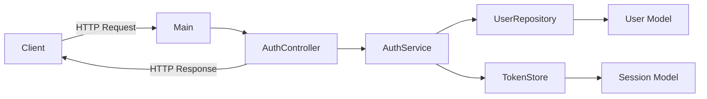

# QA_MEMO_AUTH_FLOW

このメモは、`12-build-auth-flow` の作業中に出た疑問を整理したもの。  
各項目は「疑問点」と「回答」で記録する。

## Q1. authの認証サーバーの構成はどうなっている？

疑問点:
- 「認証サーバー全体の構成を先に把握したい」

回答:
- 最小構成は `Main -> AuthController -> AuthService -> (UserRepository, TokenStore)`。
- `Main` は起動と依存組み立て、`Controller` はHTTP境界、`Service` は認証ロジック、`Repository/Store` はデータ参照とトークン状態管理を担当する。
- クライアントとのI/Fは `POST /login`（トークン発行）と `GET /me`（トークン検証）の2本を中心にする。

構成図:


## Q2. （ここに次の疑問を追加）

疑問点:
- 

回答:
- 

## Q3. `UUID` は何をしている？

疑問点:
- `String token = UUID.randomUUID().toString();` の `UUID` は何？

回答:
- `UUID` は、重複しにくい一意IDを生成するための型。
- `UUID.randomUUID().toString()` はランダムな文字列IDを作る。
- 今回はアクセストークン文字列の生成に使う。

例:
- `550e8400-e29b-41d4-a716-446655440000`

## Q4. `Instant` は何をしている？

疑問点:
- `long expiresAt = Instant.now().getEpochSecond() + TOKEN_TTL_SECONDS;` の `Instant` は何？

回答:
- `Instant` は時刻の1点（UTC基準）を表す型。
- `Instant.now()` で現在時刻を取得する。
- `getEpochSecond()` でUnix time（1970-01-01 UTCからの秒数）に変換できる。
- 今回は `現在時刻 + TTL` でトークン有効期限を計算するために使う。

## Q5. ここまでで実際に使ったコマンドと返り値を残したい

疑問点:
- 実行したコマンドとレスポンスを、そのまま後で見返せる形で残したい。
- トークン値などの可変情報は `TOKEN` のようなプレースホルダで記録したい。

回答:
- 以下の形で記録しておけば再現しやすい。

実行ログ（マスク済み）:
```bash
# 1) 未認証トークン（または無効トークン）で /me を呼ぶ
curl -i http://127.0.0.1:8080/me -H "Authorization: Bearer TOKEN"

HTTP/1.1 401 Unauthorized
Content-Type: application/json; charset=UTF-8
Content-Length: 24
Connection: close

{"error":"unauthorized"}


# 2) ログインしてトークンを発行
curl -i -X POST http://127.0.0.1:8080/login \
  -H "Content-Type: application/json" \
  -d '{"id":"demo","password":"password123"}'

HTTP/1.1 200 OK
Content-Type: application/json; charset=UTF-8
Content-Length: 92
Connection: close

{"accessToken":"TOKEN","tokenType":"Bearer","expiresIn":3600}


# 3) 発行トークンで /me を呼ぶ
curl -i http://127.0.0.1:8080/me -H "Authorization: Bearer TOKEN"

HTTP/1.1 200 OK
Content-Type: application/json; charset=UTF-8
Content-Length: 32
Connection: close

{"id":"demo","name":"Demo User"}
```
