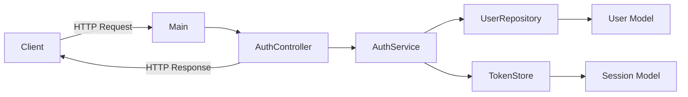

# QA_MEMO_AUTH_FLOW

このメモは、`12-build-auth-flow` の作業中に出た疑問を整理したもの。  
各項目は「疑問点」と「回答」で記録する。

## Q1. authの認証サーバーの構成はどうなっている？

疑問点:
- 「認証サーバー全体の構成を先に把握したい」

回答:
- 最小構成は `Main -> AuthController -> AuthService -> (UserRepository, TokenStore)`。
- `Main` は起動と依存組み立て、`Controller` はHTTP境界、`Service` は認証ロジック、`Repository/Store` はデータ参照とトークン状態管理を担当する。
- クライアントとのI/Fは `POST /login`（トークン発行）と `GET /me`（トークン検証）の2本を中心にする。

構成図:

## Q2. （ここに次の疑問を追加）

疑問点:
- 

回答:
- 
