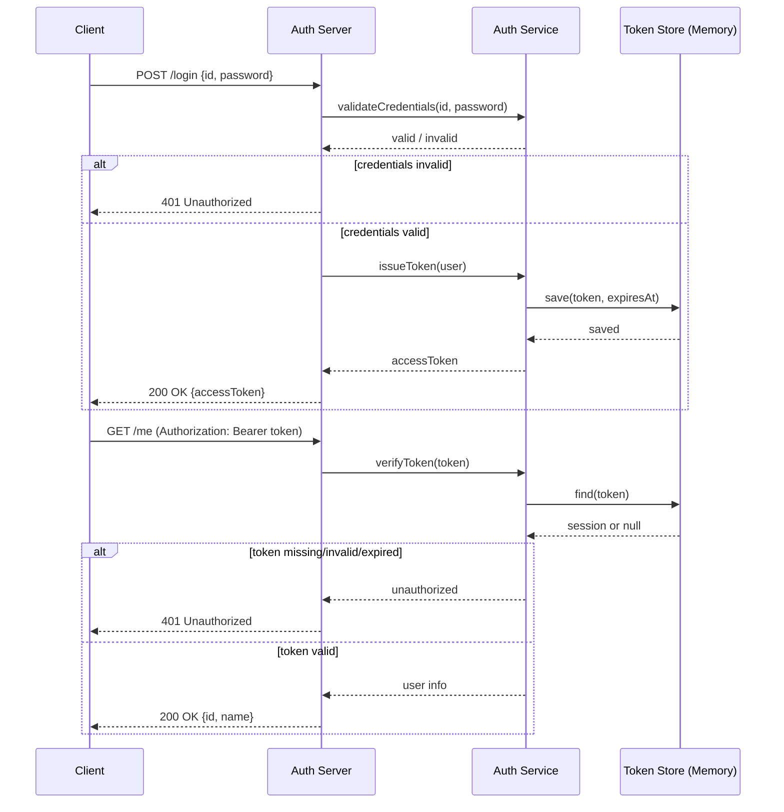

# 12 Build Auth Flow

認証フロー（ログイン・トークン発行・検証）をテーマに、最小構成の認証サーバーを実装ベースで理解するためのディレクトリ。

## 目的
- `POST /login` でID/PWを受け取り、最小トークンを発行する
- `GET /me` でトークン検証を行い、未認証時は `401` を返す
- トークン期限切れと不正トークンの失敗パターンを確認する
- 認証あり/なしのアクセスログ差分を記録する

## 実装ステップ（この順番で進める）

Step 1: `POST /login` の受け口を作る（JSON受信・ID/PW取得・バリデーション）

Step 2: 認証判定を実装する（正しいID/PWのみ成功、それ以外は `401`）

Step 3: 最小アクセストークンを発行する（乱数文字列 + 有効期限）

Step 4: `GET /me` を実装する（`Authorization: Bearer` の解析と検証）

Step 5: 失敗系を確認する（未送信・不正トークン・期限切れで `401`）

Step 6: 認証あり/なしのアクセスログ差分を記録し、READMEに残す

## 完了条件
- `POST /login` 成功時に `200` と `accessToken` を返せる
- `GET /me` は有効トークンで `200`、それ以外は `401` を返せる
- 失敗パターン3種（未送信/不正/期限切れ）の検証ログが残っている

## シーケンス図（最小認証フロー）

## フロー詳細（1ステップずつ）

1. クライアントが `POST /login` を送る  
   ID/PWをサーバーへ送信する。
2. サーバーが `Auth Service` に認証依頼  
   `validateCredentials(id, password)` を呼ぶ。
3. `Auth Service` が認証結果を返す  
   `valid` か `invalid` を返す。
4. 認証失敗なら `401 Unauthorized`  
   この時点で処理終了。
5. 認証成功ならトークン発行処理へ  
   `issueToken(user)` を実行する。
6. トークンを `Token Store` に保存  
   `save(token, expiresAt)` で有効期限付き保存。
7. サーバーが `200 OK` と `accessToken` を返す  
   クライアントは以後このトークンを利用。
8. クライアントが `GET /me` を送る  
   `Authorization: Bearer <token>` を付与する。
9. サーバーがトークン検証を依頼  
   `verifyToken(token)` を実行する。
10. `Auth Service` が `Token Store` を参照  
    `find(token)` で存在と期限を確認。
11. 無効/期限切れなら `401 Unauthorized`  
    未認証として応答する。
12. 有効ならユーザー情報を返す  
    `200 OK {id, name}` を返して完了。
