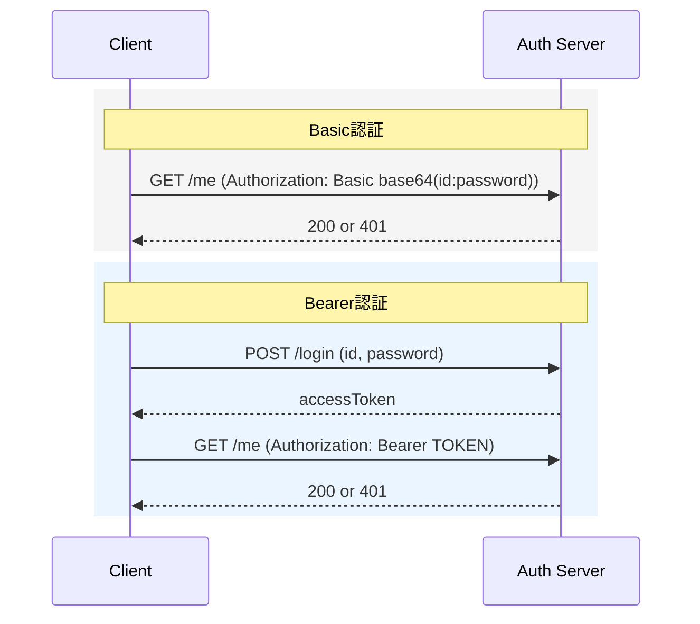

# なぜBasicではなくBearerなのか？比較から見えてきたBearerの本質

## はじめに
これまで認証サーバーについて、触れてこなかったために、理解が浅いために話題に上がった時に、会話に入れず残念な気持ちになることが多かったので、自分で自作することで、理解を深めようと思いました。
最近は、Bearer認証やOAuth認証などが使われていることがほとんどだと思いますが、Basic認証がなぜ使われなくなったのかあまりわかってなかったので、2つを比較することで、Bearer認証の本質に迫ってみました。

---

## 前提環境

- OS: macOS
- Java: OpenJDK 17.0.17 (Temurin)

---

## 全体像（Basic vs Bearer）



Basic = 毎回id/passwordを送って認証
Bearer認証 = ログインで発行されたトークンを以後のリクエストで提示して認証

このような違いがあります。Basic認証は、毎回資格情報を送る方式、Bearer認証は、トークンを使って認証状態を継続的に使える方式といえる。

---

## なぜBasicではなくBearerなのか

Basic認証は「毎回本人確認を行う方式」であるのに対し、  
Bearer認証は「一度認証した結果を使い回す方式」である。  

この違いにより、Basic認証はリクエストごとに認証処理（資格情報の検証）が発生するのに対し、  
Bearer認証はトークンの検証のみで済むため、リクエスト数が増えた場合の負荷のかかり方が大きく異なる。

言い換えると、Bearer認証は「毎回ID/パスワードを照合する仕組み」ではなく、  
「一度確認した結果（状態）を使って判定する仕組み」である。  
ここで重要になるのが、サーバーがその状態を持つかどうか（ステートレス / ステートフル）である。

---

## ステートレスとステートフル
認証方式の違いは、「状態を持つかどうか」で整理できます。

### ステートレス（Basic認証に近い）
ステートレスな設計では、サーバーはリクエスト間の状態を保持しません。  
そのため、毎回のリクエストだけで認証を完結させる必要があります。

Basic認証はこれに近く、毎回 `id/password` を送って認証します。

### ステートフル（Bearer認証に近い）
ステートフルな設計では、サーバーが状態を保持します。  
今回の実装では、`TokenStore` に `token -> Session` を保存して状態を使い回しています。

そのため、一度認証した結果をトークンとして使い回すことができます。

### この違いが意味すること
- ステートレス: 毎回認証が必要。シンプルだが拡張しづらい
- ステートフル: 状態管理が必要。その代わり期限管理や失効制御が可能

ステートレスでは「そのリクエストだけで完結する情報」を送る必要があり、  
ステートフルでは「過去の状態を参照することで処理を簡略化できる」という違いがある。

Bearer認証は、状態を持つことで運用しやすくする設計だといえます。  
（補足: BearerでもJWT中心で設計すると、よりステートレス寄りにすることは可能です）

---

## Basic認証とBearer認証のそれぞれの特徴

### Basic認証
- 毎回 `id/password` を送る
- サーバー側はほぼステートレスでも可能（状態を持たず毎回判定）
- 失効制御はしづらい

### Bearer認証
- login後は発行されたtokenを使用する
- token状態管理が必要になる（今回の実装はステートフル）
- 期限切れ/削除制御が可能
- 認証ロジックと状態管理を分離しやすい

Basic認証は構造が単純な一方で、毎回資格情報そのものを扱う必要があるため、運用上の注意が増えます。Bearer認証は状態管理が必要になる代わりに、期限管理や失効制御に対応しやすくなります。

---

## 今回の実装方針

今回はBearer認証を主役にして、最小構成を自作しました。  
Basic認証は比較対象として扱う形にしています。

対象エンドポイントは次の2つです。

- `POST /login`: id/passwordを受け取り、認証成功時にtokenを発行
- `GET /me`: `Authorization: Bearer TOKEN` を検証してユーザー情報を返す

構成は `Controller / Service / TokenStore / Session` に分けています。

---

## Bearer認証の実装

今回の実装では、責務を次のように分けました。

- `Controller`  
  HTTPの受け口。ヘッダー/本文の読み取りとレスポンス返却を担当
- `Service`  
  認証ロジック。資格情報の判定、token発行、Bearer token検証を担当
- `TokenStore`  
  tokenの保存・参照・削除を担当（`token -> Session`）
- `Session`  
  `userId` と `expiresAt` を持つデータ

`TokenStore` を分離した理由は3つです。

今回は学習用の最小実装で、今すぐ Redis/DB へ切り替える予定はありませんが、一応実務を意識して分離しています。
この時点で「状態をどこで持つか」を切り分けることで、ステートフル設計の見通しがよくなります。

- 認証ロジックと状態管理を分離するため
- 将来的に保存先をメモリから Redis/DB に変える可能性を見越して、影響を局所化するため
- 将来的に TTL や削除戦略を調整する可能性を見越して、認証判定ロジックから切り離すため

---

## Bearer認証の実装フロー

### `/login` の流れ
1. `Controller` が `id/password` を受け取る
2. `Service` が資格情報を検証する
3. 成功時にtokenを発行する
4. `TokenStore` に `Session(userId, expiresAt)` を保存する
5. クライアントへtokenを返す

### `/me` の流れ
1. `Controller` が `Authorization: Bearer TOKEN` を受け取る
2. `Service` がtokenを取り出して `TokenStore` を参照する
3. tokenの存在と `expiresAt` を検証する
4. 有効ならユーザー情報、無効なら `401` を返す

今回の実装例:

```java
private void handleLogin(Socket client, Map<String, String> headers, String requestBody) throws IOException {
    String id = extractJsonString(requestBody, "id");
    String password = extractJsonString(requestBody, "password");
    String token = authService.login(id, password);

    if (token == null) {
        sendJson(client, "401 Unauthorized", "{\"error\":\"invalid credentials\"}");
        return;
    }

    sendJson(client, "200 OK",
        "{\"accessToken\":\"" + token + "\",\"tokenType\":\"Bearer\",\"expiresIn\":3600}");
}

private void handleMe(Socket client, Map<String, String> headers, String requestBody) throws IOException {
    String authorization = headers.get("authorization");
    String userId = authService.me(authorization);

    if (userId == null) {
        sendJson(client, "401 Unauthorized", "{\"error\":\"unauthorized\"}");
        return;
    }

    sendJson(client, "200 OK", "{\"id\":\"" + userId + "\",\"name\":\"Demo User\"}");
}
```

---

## Basic認証の最小実装（比較用）

Basic認証はBearer認証のようにtokenを発行・保持せず、毎回リクエストに含まれる資格情報で認証します。

### `/me` の流れ（Basic）
1. `Controller` が `Authorization: Basic base64(id:password)` を受け取る
2. base64をデコードして `id/password` を取り出す
3. `Service` が毎回資格情報を検証する
4. 正しければユーザー情報を返し、誤っていれば `401` を返す

今回の実装例:

```java
private void handleMeBasic(Socket client, Map<String, String> headers) throws IOException {
    String authorization = headers.get("authorization");
    if (authorization == null || !authorization.startsWith("Basic ")) {
        sendJson(client, "401 Unauthorized", "{\"error\":\"unauthorized\"}");
        return;
    }

    String encoded = authorization.substring("Basic ".length()).trim();
    String decoded = new String(Base64.getDecoder().decode(encoded), StandardCharsets.UTF_8);
    String[] pair = decoded.split(":", 2);
    String id = pair.length > 0 ? pair[0] : "";
    String password = pair.length > 1 ? pair[1] : "";

    boolean ok = authService.verifyCredentials(id, password);
    if (!ok) {
        sendJson(client, "401 Unauthorized", "{\"error\":\"invalid credentials\"}");
        return;
    }

    sendJson(client, "200 OK", "{\"id\":\"demo\",\"name\":\"Demo User\"}");
}
```

Bearer認証と違い、Basic認証では `TokenStore` や `expiresAt` のような状態管理は不要です。  
その一方で、毎回資格情報そのものを扱う必要があるため、セキュリティ・拡張性・パフォーマンスの面で不利になりやすいです。  
また、外部向けレスポンスが同じ `401` に寄りやすく、Bearer認証に比べて失敗原因の切り分けがしづらい傾向があります。  
Bearer認証は状態管理が必要になる代わりに、期限管理や失効制御に対応しやすい設計になります。

---

## 比較（状態管理 / 責務 / 拡張性）

### 観点1: 状態管理
- Basic: 状態をほぼ持たない（毎回資格情報で判定）
- Bearer: 状態を持つ（今回の実装は `token -> Session` をメモリ管理）

### 観点2: 責務
- Basic: 認証判定が中心
- Bearer: 認証判定に加えて、tokenの発行・検証・失効管理が必要

### 観点3: 拡張性
- Basic: 失効制御や段階的拡張がしづらい
- Bearer: TTL / revoke / refresh などに拡張しやすい

---

## 失敗ケース（Bearer）

- 未送信: `Authorization` がない
- 不正トークン: `TokenStore` に存在しない
- 期限切れ: `expiresAt` を超過して無効化される

同じ `401` でも、失敗理由が違えば原因調査や対策が変わる点が重要です。

レスポンス例（現在の実装）:

```http
# 未送信
HTTP/1.1 401 Unauthorized
Content-Type: application/json; charset=UTF-8

{"error":"unauthorized"}
```

```http
# 不正トークン
HTTP/1.1 401 Unauthorized
Content-Type: application/json; charset=UTF-8

{"error":"unauthorized"}
```

```http
# 期限切れ
HTTP/1.1 401 Unauthorized
Content-Type: application/json; charset=UTF-8

{"error":"unauthorized"}
```

Basic認証の場合は、エラー内容が全て同じになるので、切り分けができないというデメリットがあります。

---

## 学びのまとめ

- Basic と Bearer の違い  
  Basicは毎回資格情報で認証し、Bearerは発行済みtokenを使って認証します。違いの本質は「状態を持つかどうか」でした。

- 認証ロジック  
  認証の本体は、資格情報やtokenをどう検証するかという判定ルールです。`Controller` と `Service` を分けることで整理しやすくなりました。

- 状態管理  
  Bearer認証では、tokenに紐づく状態をどこで保持するかが設計の中心になります。`TokenStore` を分離したことで役割が明確になりました。

- データライフサイクル管理  
  `expiresAt` を持たせると、tokenの生成から失効までを扱えます。認証は一致判定だけでなく、状態の寿命を管理する設計だと理解できました。
