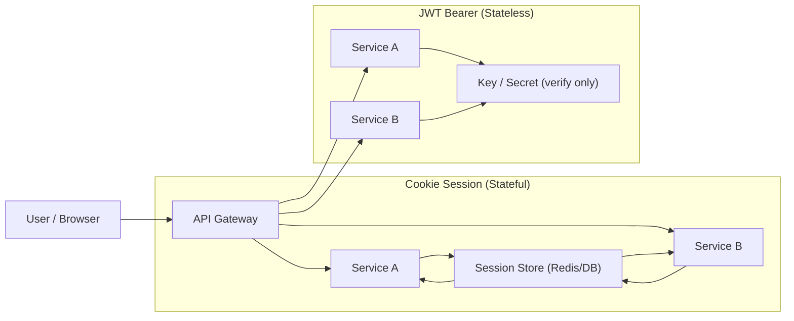

# Chapter 13 Memo

## 2026-05-02 学びメモ（実装と理解）

1. `POST /cookie/login` の役割
- `id/password` を受け取り、認証成功時にセッションを作成する。
- `sid` を発行し、`Set-Cookie` で返す。

2. `GET /cookie/me` の役割
- `Cookie: sid=...` を受け取り、現在ログイン中のユーザー情報を返す。
- `sid` が無効・期限切れなら `401`。

3. JWTはAuth0専用ではない
- JWTは標準仕様（RFC 7519）。
- 今回は Auth0 社の `java-jwt` ライブラリで実装している。

4. JWTの3ブロック（色分け）の意味
- 1ブロック目: Header（例: `alg`, `typ`）
- 2ブロック目: Payload（例: `iss`, `sub`, `iat`, `exp`）
- 3ブロック目: Signature（改ざん検知用）

5. `ey` で始まる理由
- Base64URLエンコードされたJSONで、`{"...` がエンコードされると先頭が `ey...` になりやすい。

6. 署名（Signature）の意味
- 暗号化ではなく、完全性（改ざんされていないこと）を確認するための値。
- 検証時は `header.payload` を同じ `SECRET` で再署名して比較する。

7. JWTは暗号化されているわけではない
- Header/Payloadはデコードして読める。
- 保護しているのは「改ざん検知」であって「秘匿」ではない。

8. `Invalid Signature` の意味
- JWTの形式は正しいが、検証に使ったシークレットが発行時の `SECRET` と一致していない。

9. 署名をDB保存するか
- 通常は保存しない。
- リクエストごとに署名検証を実施する。
- 例外的に失効管理（ブラックリスト）用途で `jti` 等を保存することはある。

10. `SECRET` の保存先
- 通常はサーバー側の環境変数やSecrets Manager。
- ソースコード直書き・Git管理は避ける。

11. クライアントでのJWT保持先
- 代表例: `HttpOnly Cookie` またはメモリ保持。
- `localStorage` はXSS時の窃取リスクがあるため慎重に扱う。

12. XSS観点のリスク
- 悪意あるスクリプト実行でトークンが盗まれ、なりすましに使われる。

13. CSRF対策について（最後のやり取り）
- `HttpOnly` だけではCSRF対策にならない。
- CSRF対策は `SameSite`、CSRFトークン、`Origin/Referer` チェック等を組み合わせる。
- 整理:
  - XSS対策: `HttpOnly` が有効
  - CSRF対策: `SameSite` + CSRFトークン等が必要

## 2026-05-02 追加メモ（Cookie vs JWTの整理）

1. Cookie Session と JWT Bearer の実装差分
- Cookie Session:
  - 認証情報は `sid`
  - サーバー側で状態保持（`SessionStore`）
  - `Set-Cookie` で配布し、次回以降はCookie自動送信
- JWT Bearer:
  - 認証情報はJWT本体
  - トークン自己完結（サーバーは基本無状態）
  - `Authorization: Bearer <token>` で送信

2. 「どこに保存するか」の意味
- クライアントで認証情報をどこに置くかの設計。
- 候補: Cookie / localStorage / sessionStorage / メモリ。

3. 「自動送信か手動送信か」の意味
- 自動送信: Cookie（ブラウザが自動で付与）
- 手動送信: Bearer（フロントコードが `Authorization` を付与）

4. Bearer認証とJWTの関係
- JWTはトークンのフォーマット（中身仕様）。
- Bearerはトークンの運搬方式（`Authorization` ヘッダーで送る方法）。
- 関係: 「JWTをBearer方式で運ぶ」が典型。

5. セキュリティ観点の要点
- `Set-Cookie` で返すこと自体がXSSの直接原因ではない。
- `HttpOnly` CookieならJSから読み取りにくくなり、窃取リスク低減。
- ただしCookie自動送信のためCSRF対策が別途必要。
- JWTを `localStorage` に置く場合はXSS時の読み取りリスクに注意。

## 比較表（整理用）

| 観点 | Cookie Session | JWT Bearer |
|---|---|---|
| 認証情報 | `sid`（短いID） | JWT本体（クレーム入り） |
| 状態保持 | サーバー側（SessionStore） | トークン側（基本サーバー無状態） |
| 失効/ログアウト | セッション削除で即時失効しやすい | 期限まで有効になりやすく失効が難しい |
| スケール | 共有セッションストアが必要 | 比較的スケールしやすい |
| リクエストサイズ | 小さめ | やや大きめ |
| 送信方式 | Cookieで自動送信 | Authorizationヘッダーで手動送信が基本 |

## 比較に対する回答（要点）

1. 「CookieはXSSで抜かれるのか？」
- `Set-Cookie` で返すこと自体がリスクではない。
- `HttpOnly` を付ければJSから読み取りにくくなり、窃取リスクは下がる。

2. 「JWTのほうが安全か？
- JWTかCookieか単体で優劣は決まらない。
- 実際は「保存場所」「送信方式」「失効要件」で安全性が大きく変わる。

3. 「何で選ぶか？」
- 即時失効や強い制御が重要なら Cookie Session が扱いやすい。
- 分散構成や疎結合が重要なら JWT Bearer が扱いやすい。

## 2026-05-02 追加Q&Aメモ

1. ステートフル/ステートレスであることのメリット
- Cookie Session（ステートフル）のメリット:
  - ログアウト/強制失効を即時反映しやすい
  - 同時ログイン制限などセッション制御を中央で行いやすい
- JWT Bearer（ステートレス）のメリット:
  - セッション共有ストアなしで水平スケールしやすい
  - サービスごとにトークン検証して判定でき、分散構成に向く

2. `HttpOnly` を付けるとJSから読み取りにくくなる理由
- ブラウザが `HttpOnly` 属性付きCookieを `document.cookie` へ公開しないため。
- その結果、XSSで実行されたスクリプトからCookie値を直接窃取しにくくなる。
- ただしCookie自動送信はされるため、CSRF対策は別途必要。

3. JWTがマイクロサービス間で受け渡ししやすい理由
- JWTはトークン自体にクレームと署名を持つ。
- 各サービスが同じ鍵（または公開鍵）で独立検証できる。
- 中央セッションストア参照への依存を減らせる。

## 構成図（Stateful vs Stateless）

## 使い分けの目安（サービス特性別）

1. Cookie Session が向くケース
- 即時ログアウト・強制失効を重視するサービス
- 管理画面/社内システムなど厳密制御を優先するサービス
- 同時ログイン制限などセッション単位の制御が必要なサービス
- 単一ドメイン中心のWebアプリ

2. JWT Bearer が向くケース
- モバイル/SPA/API中心でBearer運用したいサービス
- マイクロサービス/分散構成で水平スケールしたいサービス
- サービス間連携（Gateway -> 各API）が多いサービス
- 各サービスで認証判定を自己完結させたいサービス

3. 実務での選定軸（短い結論）
- 制御性重視なら Cookie Session
- 拡張性/分散重視なら JWT Bearer
- どちらを選んでも、XSS/CSRF/失効戦略はセットで設計する
